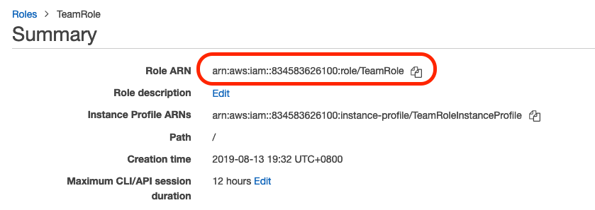
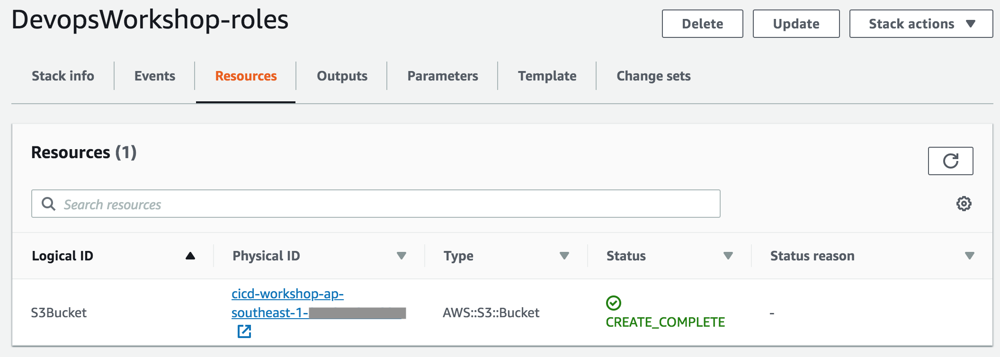
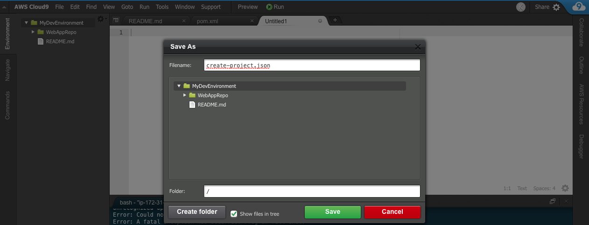
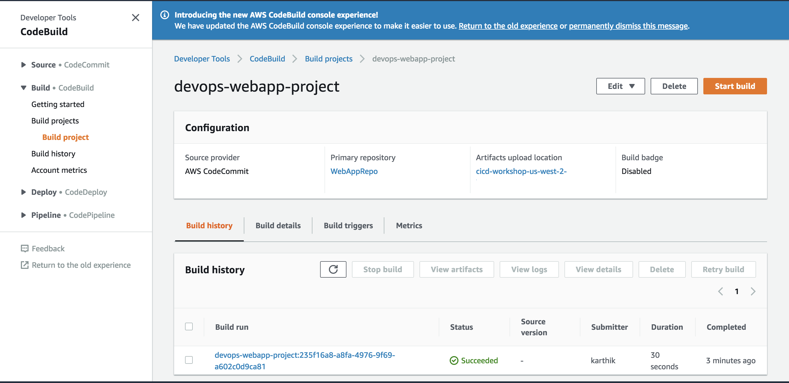

## Lab 1 - Build project on the cloud

### Lab IAM Permissions
As the AWS accounts you are about to use are **lab accounts**, they do not have permissions to make any changes to IAM settings. For any commands/steps that requires IAM Role ARN, please kindly use the pre-created role: **TeamRole**.

https://console.aws.amazon.com/iam/home?region=ap-southeast-1#/roles/TeamRole

***It will be useful to note down the ARN for Team Role which will be required throughout the lab***


### AWS Cloud9 IDE - Set up

AWS Cloud9 is a cloud-based integrated development environment (IDE) that lets you write, run, and debug your code with just a browser. It includes a code editor, debugger, and terminal. Cloud9 comes pre-packaged with essential tools for popular programming languages and the AWS Command Line Interface (CLI) pre-installed so you don't need to install files or configure your laptop for this workshop. Your Cloud9 environment will have access to the same AWS resources as the user with which you logged into the AWS Management Console.

Take a moment now and setup your Cloud9 development environment.

### ✅  Step-by-step Instructions

1. Go to the AWS Management Console, click **Services** then select **Cloud9** under Developer Tools.
2. Click **Create environment**.
3. Enter `MyDevEnvironment` into **Name** and optionally provide a **Description**.

  

4. Click **Next step**.
5. You may leave **Environment settings** at their defaults of launching a new **t2.micro** EC2 instance which will be paused after **30 minutes** of inactivity.
6. Click **Next step**.
7. Review the environment settings and click **Create environment**. It will take several minutes for your environment to be provisioned and prepared.
8. Once ready, your IDE will open to a welcome screen. Below that, you should see a terminal prompt similar to:  You can run AWS CLI commands in here just like you would on your local computer. Verify that your user is logged in by running the following command.

```console
user:~/environment $ aws sts get-caller-identity
```

You'll see output indicating your account and user information:
```console
{
    "Account": "123456789012",
    "UserId": "AKIAI44QH8DHBEXAMPLE",
    "Arn": "arn:aws:iam::123456789012:user/user"
}
```

Keep your AWS Cloud9 IDE opened in a tab throughout this workshop as we'll use it for activities like cloning, pushing changes to repository and using the AWS CLI.

### 💡 Tips

Keep an open scratch pad in Cloud9 or a text editor on your local computer for notes. When the step-by-step directions tell you to note something such as an ID or Amazon Resource Name (ARN), copy and paste that into the scratch pad.

***

### Stage 1: Create an AWS CodeCommit Repository

**_To create the AWS CodeCommit repository (console)_**

1. Open the AWS CodeCommit console at <https://console.aws.amazon.com/codecommit>.

2. On the Welcome page, choose Get Started Now. (If a **_Dashboard_** page appears instead, choose **_Create repository_**.)
3. On the **_Create repository_** page, in the **_Repository name_** box, type **_WebAppRepo_**.
> It is advised that you use the same repository name, **_WebAppRepo_** as it will be used throughout this lab.
4. In the **_Description_** box, optionally type in a description for this repository.

5. Choose **_Create_** to create an empty AWS CodeCommit repository named **_WebAppRepo_**.

**Note:** The remaining steps in this lab assume you have named your AWS CodeCommit repository **_WebAppRepo_**. If you use a name other than **_WebAppRepo_**, be sure to use it throughout this tutorial. For more information about creating repositories, including how to create a repository from the terminal or command line, see [Create a Repository](http://docs.aws.amazon.com/codecommit/latest/userguide/how-to-create-repository.html).

***

### Stage 2: Clone the Repo

Before we start to clone the Repo, we need to configure the AWS CLI credential helper to manage the credentials for connections to your AWS CodeCommit repository. The AWS Cloud9 development environment comes with AWS managed temporary credentials that are associated with your IAM user. You use these credentials with the AWS CLI credential helper.

1. Update the packages within your AWS Cloud9 instance.
```console
user:~/environment $ sudo yum update -y
```

2. Configure your chosen user name and email to be associated with your Git commits by running the git config command. For example:
```console
user:~/environment $ git config --global user.name "Mary Major"
user:~/environment $ git config --global user.email mary.major@example.com
```
>Note: You may use any name/email for the above. No emails will be sent out.
3. Run the following commands to configure the AWS CLI credential helper for HTTPS connections:
```console
user:~/environment $ git config --global credential.helper '!aws codecommit credential-helper $@'
user:~/environment $ git config --global credential.UseHttpPath true
```

We can now connect to the source repository created in stage 1. Here, you use Git to clone and initialize a copy of your empty AWS CodeCommit repository.

1. From CodeCommit Console, you can get the **https clone url** link for your repo.
2. Go to Cloud9 IDE terminal prompt
3. Run git clone to pull down a copy of the repository into the local repo:

```console
user:~/environment $ git clone https://git-codecommit.ap-southeast-1.amazonaws.com/v1/repos/WebAppRepo

```
You would be seeing the following message if cloning is successful.

```console
warning: You appear to have cloned an empty repository.
```
***

### Stage 3: Commit changes to Remote Repo

1. Download the Sample Web App Archive by running the following command from IDE terminal.

```console
user:~/environment $ wget https://github.com/yiangmeng/aws-devops-introduction/raw/master/sample-app/Web-App-Archive.zip
```

2. Unarchive and copy all the **_contents_** of the unarchived folder to your local repo folder.

```console
user:~/environment $ unzip Web-App-Archive.zip
user:~/environment $ mv -v Web-App-Archive/* WebAppRepo/
```

After moving the files, your local repo should like the one below. 
3. Change the directory to your local repo folder. Run **_git add_** to stage the change:

```console
user:~/environment $ cd WebAppRepo
user:~/environment/WebAppRepo/ $ git add *
```

4. Run **_git commit_** to commit the change:

```console
user:~/environment/WebAppRepo/ $ git commit -m "Initial Commit"
```

**_💡 Tip_** To see details about the commit you just made, run **_git log_**.

5. Run **_git push_** to push your commit through the default remote name Git uses for your AWS CodeCommit repository (origin), from the default branch in your local repo (master):

```console
user:~/environment/WebAppRepo/ $ git push -u origin master
```

**_💡 Tip_** After you have pushed files to your AWS CodeCommit repository, you can use the [AWS CodeCommit console](https://console.aws.amazon.com/codecommit/home) to view the contents.


For more information, see [Browse the Contents of a Repository](http://docs.aws.amazon.com/codecommit/latest/userguide/how-to-browse.html).

***

### Stage 4: Prepare Build Service

1. First, let us create an S3 buckets to store artifacts for our build/deploy artifacts. Head over to [Amazon S3](https://s3.console.aws.amazon.com/s3/home?region=ap-southeast-1) console.

2. You will see that you have no buckets created in your account. Click on Create bucket.

3. Enter `webapp-bucket-12345` as the **Bucket name**, while replacing `12345` with a random string of characters as you wish. The S3 bucket name has to be unique in the region.

4. Click on **Create**.

  

5. Let's create an AWS CodeBuild project and point to this bucket as artifact repository. Head over to [AWS CodeBuild](https://ap-southeast-1.console.aws.amazon.com/codesuite/codebuild/projects?region=ap-southeast-1) console.

> Need to create codebuild role first

6. Click on **Create build project**.

7. Enter `MyCodeBuildProject` as the **Project name** (or anything you'd like to name the build project).

8. Enter any description for the build project.

9. Check **Build badge** to enable build badge.

10. Under **Source provider**, select **_AWS CodeCommit_**.

11. Click on **Repository** and select **_WebAppRepo_**.

12. Select **_master_** for **Branch**

13. Select **_Custom image_** for **Environment image**.

14. Select **_Linux_** for **Environment type**.

15. Select **_Amazon ECR_** for **Image registry**,

16. Select **_Other ECR account_** for **ECR account**.

17. Enter `aws/codebuild/java` for the **Amazon ECR repository URI**.

18. Enter `openjdk-8` for the **Amazon ECR image tag**.

19. Select **_New service role_** for **Service role**.

20. Enter `CodeBuildRole` for **Role name**.

21. Select **_Use a buildspec file_** for **Build specifications**.

22. Select **_Amazon S3_** for Artifacts **Type**.

23. Select **_webapp-bucket-12345_** (or whichever you have named) for the **Bucket name**.

24. Enter `WebAppOutputArtifact.zip` for **Name** of the output artifact.

25. Select **_Zip_** for **Artifacts packaging**.

26. Click on **Create build project**.

2. Upon completion take a note of the name of the bucket created. Check [describe-stacks](http://docs.aws.amazon.com/cli/latest/reference/cloudformation/describe-stacks.html) to find the output of the stack.
```console
user:~/environment/WebAppRepo (master) $ aws cloudformation describe-stacks
```

3. For Console, refer to the CloudFormation [Outputs tab](https://ap-southeast-1.console.aws.amazon.com/cloudformation/home?region=ap-southeast-1) to see output. Make a note of the S3 bucket name. This will be used to store the output from CodeBuild in the next step. **_Sample Output:_** 

4. Run the following commands to get the value of the S3 bucket from cloudformation template launched earlier.

```console
user:~/environment/WebAppRepo (master) $ sudo yum -y install jq
user:~/environment/WebAppRepo (master) $ echo $(aws cloudformation describe-stacks --stack-name DevopsWorkshop-roles | jq -r '.Stacks[0].Outputs[]|select(.OutputKey=="S3BucketName")|.OutputValue')
```

5. Let us **create CodeBuild** project from **CLI**. To create the build project using AWS CLI, we need JSON-formatted input.
    **_Create_** a json file named **_'create-project.json'_** under 'MyDevEnvironment'.  Copy the content below to create-project.json. (Replace the placeholders marked with **_<<>>_** with  values for BuildRole ARN and S3 Output Bucket from the previous step.)


```json
{
  "name": "devops-webapp-project",
  "source": {
    "type": "CODECOMMIT",
    "location": "https://git-codecommit.ap-southeast-1.amazonaws.com/v1/repos/WebAppRepo"
  },
  "artifacts": {
    "type": "S3",
    "location": "<<REPLACE-YOUR-CODEBUILD-OUTPUT-BUCKET-FROM-CLOUDFORMATION>>",
    "packaging": "ZIP",
    "name": "WebAppOutputArtifact.zip"
  },
  "environment": {
    "type": "LINUX_CONTAINER",
    "image": "aws/codebuild/java:openjdk-8",
    "computeType": "BUILD_GENERAL1_SMALL"
  },
  "serviceRole": "<<REPLACE-WITH-TEAM-ROLE-ARN>>"
}
```

  To know more about the codebuild project json [review the spec](http://docs.aws.amazon.com/codebuild/latest/userguide/create-project.html#create-project-cli).


6. Switch to the directory that contains the file you just saved, and run the **_create-project_** command:

```console
user:~/environment/WebAppRepo (master) $ aws codebuild create-project --cli-input-json file://../create-project.json
```

7. Sample output JSON for your reference

```json
{
  "project": {
    "name": "project-name",
    "description": "description",
    "serviceRole": "serviceRole",
    "tags": [
      {
        "key": "tags-key",
        "value": "tags-value"
      }
    ],
    "artifacts": {
      "namespaceType": "namespaceType",
      "packaging": "packaging",
      "path": "path",
      "type": "artifacts-type",
      "location": "artifacts-location",
      "name": "artifacts-name"
    },
    "lastModified": lastModified,
    "timeoutInMinutes": timeoutInMinutes,
    "created": created,
    "environment": {
      "computeType": "computeType",
      "image": "image",
      "type": "environment-type",
      "environmentVariables": [
        {
          "name": "environmentVariable-name",
          "value": "environmentVariable-value",
          "type": "environmentVariable-type"
        }
      ]
    },
    "source": {
      "type": "source-type",
      "location": "source-location",
      "buildspec": "buildspec",
      "auth": {
        "type": "auth-type",
        "resource": "resource"
      }
    },
    "encryptionKey": "encryptionKey",
    "arn": "arn"
  }
}
```

8. If successful, output JSON should have values such as:
  * The lastModified value represents the time, in Unix time format, when information about the build project was last changed.
  * The created value represents the time, in Unix time format, when the build project was created.
  * The ARN value represents the ARN of the build project.

**_Note_** Except for the build project name, you can change any of the build project's settings later. For more information, see [Change a Build Project's Settings (AWS CLI)](http://docs.aws.amazon.com/codebuild/latest/userguide/change-project.html#change-project-cli).

***

### Stage 5: Let's build the code on cloud

1. A build spec is a collection of build commands and related settings in YAML format, that AWS CodeBuild uses to run a build.
    Create a file namely, **_buildspec.yml_** under **WebAppRepo** folder. Copy the content below to the file and **save** it. To know more about [how CodeBuild works](http://docs.aws.amazon.com/codebuild/latest/userguide/concepts.html#concepts-how-it-works).

```yaml
version: 0.1

phases:
  install:
    commands:
      - echo Nothing to do in the install phase...
  pre_build:
    commands:
      - echo Nothing to do in the pre_build phase...
  build:
    commands:
      - echo Build started on `date`
      - mvn install
  post_build:
    commands:
      - echo Build completed on `date`
artifacts:
  files:
    - target/javawebdemo.war
  discard-paths: no
```

As a sample shown below:


**_Note_** Visit this [page](http://docs.aws.amazon.com/codebuild/latest/userguide/build-spec-ref.html) to know more about build spec and how you can use multiple build specs in the same repo.

2. Commit & push the build specification file to repository
```console
user:~/environment/WebAppRepo/ $ git add buildspec.yml
user:~/environment/WebAppRepo/ $ git commit -m "adding buildspec.yml"
user:~/environment/WebAppRepo/ $ git push -u origin master

```

3. Run the **_start-build_** command:

```console
user:~/environment/WebAppRepo (master) $ aws codebuild start-build --project-name devops-webapp-project
```

**_Note:_** You can start build with more advance configuration setting via JSON. If you are interested to learn more about it, please visit [here](http://docs.aws.amazon.com/codebuild/latest/userguide/run-build.html#run-build-cli).

4. If successful, data would appear showing successful submission. Make a note of the build id value. You will need it in the next step.
5. In this step, you will view summarized information about the status of your build.

```console
user:~/environment/WebAppRepo (master) $ aws codebuild batch-get-builds --ids <<ID>>
```

**_Note:_** Replace <<ID>> with the id value that appeared in the output of the previous step.

6. You will also be able to view detailed information about your build in CloudWatch Logs. You can complete this step by visiting the [AWS CodeBuild console](https://console.aws.amazon.com/codebuild/home).


7. In this step, you will verify the **_WebAppOutputArtifact.zip_** file that AWS CodeBuild built and then uploaded to the output bucket. You can complete this step by **visiting** the **AWS CodeBuild console** or the **Amazon S3 console**.

**_Note:_** Troubleshooting CodeBuild - Use the [information](http://docs.aws.amazon.com/codebuild/latest/userguide/troubleshooting.html) to help you identify, diagnose, and address issues.

### Summary:

This **concludes Lab 1**. In this lab, we successfully created repository with version control using AWS CodeCommit and built our code on the cloud using AWS CodeBuild service. You can now move to the next Lab,

[Lab 2 - Automate deployment for testing](2_Lab2.md)
