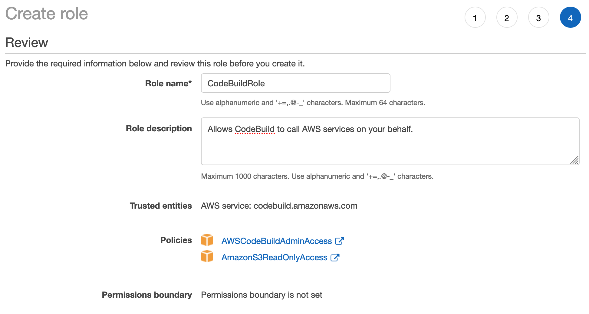
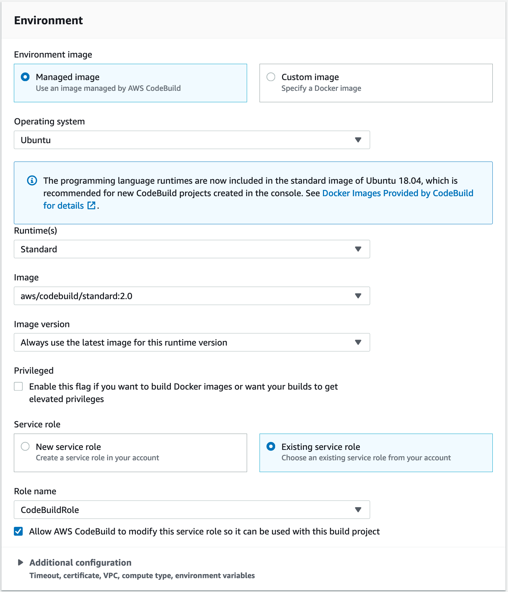

## Lab 1 - Build project on the cloud

### AWS Cloud9 IDE - Set up

**AWS Cloud9** is a cloud-based integrated development environment (IDE) that lets you write, run, and debug your code with just a browser. It includes a code editor, debugger, and terminal. Cloud9 comes pre-packaged with essential tools for popular programming languages and the AWS Command Line Interface (CLI) pre-installed so you don't need to install files or configure your laptop for this workshop. Your Cloud9 environment will have access to the same AWS resources as the user with which you logged into the AWS Management Console.

Take a moment now to setup your Cloud9 development environment.

1. Head over to the [AWS Cloud9](https://ap-southeast-1.console.aws.amazon.com/cloud9/home?region=ap-southeast-1) console.
2. Click **Create environment**.
3. Enter `MyDevEnvironment` into **Name** and optionally provide a **Description**.

  

4. Click **Next step**.
5. You may leave **Environment settings** at their defaults of launching a new **t2.micro** EC2 instance which will be paused after **30 minutes** of inactivity.
6. Click **Next step**.
7. Review the environment settings and click **Create environment**. It will take several minutes for your environment to be provisioned and prepared.
8. Once ready, your IDE will open to a welcome screen. Below that, you should see a terminal prompt similar to:

  

  You can run AWS CLI commands in here just like you would on your local computer. Verify that your user is logged in by running the following command:

  ```console
  user:~/environment $ aws sts get-caller-identity
  ```

  You'll see output indicating your account and user information:
  ```console
  {
      "Account": "123456789123",
      "UserId": "AROA4ABCDE2ABCKVTJQI:MasterKey",
      "Arn": "arn:aws:sts::123456789123:assumed-role/TeamRole/MasterKey"
  }
  ```

  > 💡 Tip: Keep your AWS Cloud9 IDE opened in a tab throughout this workshop as we'll use it for activities like cloning, pushing changes to repository and using the AWS CLI.

***

### Stage 1: Create an AWS CodeCommit Repository
**AWS CodeCommit** is a fully-managed source control service that hosts secure Git-based repositories. It makes it easy for teams to collaborate on code in a secure and highly scalable ecosystem. CodeCommit eliminates the need to operate your own source control system or worry about scaling its infrastructure.

In this workshop, we will be using AWS CodeCommit as our code repository.

1. Head over to the [AWS CodeCommit](https://console.aws.amazon.com/codecommit) console.

2. On the Welcome page, choose **Get Started Now**. (If a **_Dashboard_** page appears instead, choose **_Create repository_**.)

3. On the **_Create repository_** page, in the **_Repository name_** box, type **_WebAppRepo_**.

4. In the **_Description_** box, optionally type in a description for this repository.

  

5. Choose **_Create_** to create an empty AWS CodeCommit repository named **_WebAppRepo_**.

**Note:** The remaining steps in this lab assume you have named your AWS CodeCommit repository **_WebAppRepo_**. If you use a name other than **_WebAppRepo_**, be sure to use it throughout this tutorial. For more information about creating repositories, including how to create a repository from the terminal or command line, see [Create a Repository](http://docs.aws.amazon.com/codecommit/latest/userguide/how-to-create-repository.html).

***

### Stage 2: Clone the Repo

Before we start to clone the Repo, we need to configure the AWS CLI credential helper to manage the credentials for connections to your AWS CodeCommit repository. The AWS Cloud9 development environment comes with AWS managed temporary credentials that are associated with your IAM user. You use these credentials with the AWS CLI credential helper.

1. Update the packages within your AWS Cloud9 instance.
```console
user:~/environment $ sudo yum update -y
```

2. Configure your chosen user name and email to be associated with your Git commits by running the git config command. For example:
```console
user:~/environment $ git config --global user.name "Mary Major"
user:~/environment $ git config --global user.email mary.major@example.com
```
>Note: You may use any name/email for the above. No emails will be sent out.
3. Run the following commands to configure the AWS CLI credential helper for HTTPS connections:
```console
user:~/environment $ git config --global credential.helper '!aws codecommit credential-helper $@'
user:~/environment $ git config --global credential.UseHttpPath true
```

We can now connect to the source repository created in stage 1. Here, you use Git to clone and initialize a copy of your empty AWS CodeCommit repository.

1. From CodeCommit Console, you can get the **https clone url** link for your repo.
2. Go to Cloud9 IDE terminal prompt
3. Run git clone to pull down a copy of the repository into the local repo:

```console
user:~/environment $ git clone https://git-codecommit.ap-southeast-1.amazonaws.com/v1/repos/WebAppRepo

```
You would be seeing the following message if cloning is successful.

```console
warning: You appear to have cloned an empty repository.
```
***

### Stage 3: Commit changes to Remote Repo

1. Download the Sample Web App Archive by running the following command from IDE terminal.

```console
user:~/environment $ wget https://github.com/yiangmeng/aws-devops-introduction/raw/master/sample-app/Web-App-Archive.zip
```

2. Unarchive and copy all the **_contents_** of the unarchived folder to your local repo folder.

```console
user:~/environment $ unzip Web-App-Archive.zip
user:~/environment $ mv -v Web-App-Archive/* WebAppRepo/
```

After moving the files, your local repo should like the one below. 
3. Change the directory to your local repo folder. Run **_git add_** to stage the change:

```console
user:~/environment $ cd WebAppRepo
user:~/environment/WebAppRepo/ $ git add *
```

4. Run **_git commit_** to commit the change:

```console
user:~/environment/WebAppRepo/ $ git commit -m "Initial Commit"
```

**_💡 Tip_** To see details about the commit you just made, run **_git log_**.

5. Run **_git push_** to push your commit through the default remote name Git uses for your AWS CodeCommit repository (origin), from the default branch in your local repo (master):

```console
user:~/environment/WebAppRepo/ $ git push -u origin master
```

**_💡 Tip_** After you have pushed files to your AWS CodeCommit repository, you can use the [AWS CodeCommit console](https://console.aws.amazon.com/codecommit/home) to view the contents.


For more information, see [Browse the Contents of a Repository](http://docs.aws.amazon.com/codecommit/latest/userguide/how-to-browse.html).

***

### Stage 4: Prepare Build Service

1. First, let us create an S3 buckets to store artifacts for our build/deploy artifacts. Head over to [Amazon S3](https://s3.console.aws.amazon.com/s3/home?region=ap-southeast-1) console.

2. You will see that you have no buckets created in your account. Click on Create bucket.

3. Enter `webapp-bucket-12345` as the **Bucket name**, while replacing `12345` with a random string of characters as you wish. The S3 bucket name has to be unique in the region.

4. Click on **Create**.

  

***

### Stage 5: Create the Build Service Role
**AWS CodeBuild** is a fully managed continuous integration service that compiles source code, runs tests, and produces software packages that are ready to deploy. With CodeBuild, you don’t need to provision, manage, and scale your own build servers. CodeBuild scales continuously and processes multiple builds concurrently.

1. Let's now initialize a AWS CodeBuild project. Before we do that, let's create an IAM role for this Build service to give it permissions to call other AWS services on your behalf. Head over to [IAM Roles](https://console.aws.amazon.com/iam/home?#/roles) console.

2. Click on **Create role**.

3. Under **Select type of trusted entity**, choose **AWS service**.

4. Under **Choose the service that will use this role** select **CodeBuild**.

  

5. Click on **Next: Permissions**.

6. Under **Attach permission policies**, check **_AWSCodeBuildAdminAccess_**.

  

7. Additionally, search for _s3_ and check **_AmazonS3ReadOnlyAccess_**.

  

8. Click on **Next: Tags** to proceed.

9. Click on **Next: Review**.

10. Enter `CodeBuildRole` in **Role name**. You should also see **AWSCodeBuildAdminAccess** and **AmazonS3FullAccess** in the list of policies attached as shown.

  

11. Click on **Create role** to complete creating the role.

***

### Stage 6: Create the Build Service

1. Head over to the [AWS CodeBuild](https://ap-southeast-1.console.aws.amazon.com/codesuite/codebuild/projects?region=ap-southeast-1) console.

2. Click on **Create build project**.

#### Project configuration
3. Enter `MyCodeBuildProject` as the **Project name** (or anything you'd like to name the build project).

4. Enter any description for the build project.

5. Check **Enable build badge** to enable build badges.

  

#### Source Setup
6. Under **Source provider**, select **_AWS CodeCommit_**.

7. Click on **Repository** and select **_WebAppRepo_**.

8. Select **_master_** for **Branch**

  

#### Environment Setup
9. Select **_Managed image_** for **Environment image**.

10. Select **_Ubuntu_** for **Operating system**.

11. Select **_Standard_** for **Runtime(s)**,

13. Select **_aws/codebuild/standard:2.0_** for **Image**,

14. Select **_Always use the latest image for this runtime version_** for the **Image version**.

15. Select **_Existing service role_** for **Service role**.

16. Select the **_CodeBuildRole_** which we have created earlier for the **Role Name**.

  

#### Buildspec Setup
17. Select **_Use a buildspec file_** for **Build specifications**.

  

#### Artifacts Setup

18. Select **_Amazon S3_** for Artifacts **Type**.

19. Select **_webapp-bucket-12345_** (or whichever you have named) for the **Bucket name**.

20. Enter `WebAppOutputArtifact.zip` for **Name** of the output artifact.

21. Select **_Zip_** for **Artifacts packaging**.

  

22. Click on **Create build project**.

***

### Stage 7: Let's build the code on cloud

A buildspec is a collection of build commands and related settings in YAML format, that AWS CodeBuild uses to run a build. To learn more about the buildspec syntax and what it means, check out the documentation [here](https://docs.aws.amazon.com/codebuild/latest/userguide/build-spec-ref.html#build-spec-ref-syntax).

1. Create a new file in your Cloud9 console by clicking on the **+** icon. Select **New File**.
  

2. Copy the contents below to the file.

  ```yaml
  version: 0.2

  phases:
    install:
        runtime-versions:
            java: openjdk8
    pre_build:
      commands:
        - echo Nothing to do in the pre_build phase...
    build:
      commands:
        - echo Build started on `date`
        - mvn install
    post_build:
      commands:
        - echo Build completed on `date`
  artifacts:
    files:
      - target/javawebdemo.war
  ```

3. **Save** the file by clicking on File > Save. Enter `buildspec.yml` as the **Filename** and save the file in the **_WebApprepo_** folder as shown:

  

4. In your Cloud9 console, commit & push the build specification file to repository using the commands below:
```console
user:~/environment/WebAppRepo/ $ git add buildspec.yml
user:~/environment/WebAppRepo/ $ git commit -m "adding buildspec.yml"
user:~/environment/WebAppRepo/ $ git push -u origin master
```

5. Go back or open up the [CodeBuild console](https://ap-southeast-1.console.aws.amazon.com/codesuite/codebuild/projects?region=ap-southeast-1).

6. Select the CodeBuild project (**MyCodeBuildProject**) that you have created earlier and click on **Start build**.

  

7. Click on **Start build** to begin the build process with default settings.

>Alternatively, you can also initiate a start-build command from your Cloud9 console via the following command:
```console
user:~/environment/WebAppRepo (master) $ aws codebuild start-build --project-name MyCodeBuildProject
```
8. Notice the log generated by the build process.

9. Once the build is completed, you can head over to [Amazon S3](https://console.aws.amazon.com/s3/home?region=ap-southeast-1) and view the artifact uploaded into the output S3 bucket.

  

>**_Note:_** Troubleshooting CodeBuild - Use the [information](http://docs.aws.amazon.com/codebuild/latest/userguide/troubleshooting.html) to help you identify, diagnose, and address any issues.


### Summary:

This **concludes Lab 1**. In this lab, we successfully created repository with version control using AWS CodeCommit and built our code on the cloud using AWS CodeBuild service. You can now move to the next Lab,

[Lab 2 - Automate deployment for testing](2_Lab2.md)
