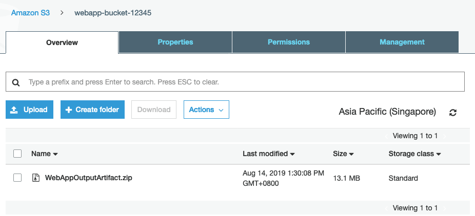

## [CLI] Lab 1 - Build project on the cloud

### AWS Cloud9 IDE - Set up

**AWS Cloud9** is a cloud-based integrated development environment (IDE) that lets you write, run, and debug your code with just a browser. It includes a code editor, debugger, and terminal. Cloud9 comes pre-packaged with essential tools for popular programming languages and the AWS Command Line Interface (CLI) pre-installed so you don't need to install files or configure your laptop for this workshop. Your Cloud9 environment will have access to the same AWS resources as the user with which you logged into the AWS Management Console.

Take a moment now to setup your Cloud9 development environment.

1. Head over to the [AWS Cloud9](https://ap-southeast-1.console.aws.amazon.com/cloud9/home?region=ap-southeast-1) console.
2. Click **Create environment**.
3. Enter `MyDevEnvironment` into **Name** and optionally provide a **Description**.

  

4. Click **Next step**.
5. You may leave **Environment settings** at their defaults of launching a new **t2.micro** EC2 instance which will be paused after **30 minutes** of inactivity.
6. Click **Next step**.
7. Review the environment settings and click **Create environment**. It will take several minutes for your environment to be provisioned and prepared.
8. Once ready, your IDE will open to a welcome screen. Below that, you should see a terminal prompt similar to:

  

9. Next, let's turn off the default Cloud9 Temporary Credentials feature. Go to Cloud9 at the top left corner, select **Preferences**.

  

10. Navigate to **AWS Settings**, turn off **AWS managed temporary credentials**. Close the **Preferences** tab when done.


11. We will use the credentials created for your account for the rest of this lab. Open up the [Event Engine Dashboard](https://dashboard.eventengine.run/dashboard) page again.

12. Click on **AWS Console**.

13. Copy the **Credentials** information you see in the code block.
  

14. Paste them into your Cloud9 console and press **Enter**.


10. Verify that your user is logged in by running the following command:

  ```console
  user:~/environment $ aws sts get-caller-identity
  ```

  You'll see output indicating your account and user information:
  ```console
  {
      "Account": "123456789123",
      "UserId": "AROA4ABCDE2ABCKVTJQI:MasterKey",
      "Arn": "arn:aws:sts::123456789123:assumed-role/TeamRole/MasterKey"
  }
  ```

  > 💡 Tip: Keep your AWS Cloud9 IDE opened in a tab throughout this workshop as we'll use it for activities like cloning, pushing changes to repository and using the AWS CLI.


***

### Stage 1: Create an AWS CodeCommit Repository
**AWS CodeCommit** is a fully-managed source control service that hosts secure Git-based repositories. It makes it easy for teams to collaborate on code in a secure and highly scalable ecosystem. CodeCommit eliminates the need to operate your own source control system or worry about scaling its infrastructure.

In this workshop, we will be using AWS CodeCommit as our code repository.

1. Run the following command to create an AWS CodeCommit repository:
```console
user:~/environment $ aws codecommit create-repository --repository-name WebAppRepo
```

2. If successful, you will see an output of the repository created:
```console
{
    "repositoryMetadata": {
        "repositoryName": "WebAppRepo",
        "cloneUrlSsh": "ssh://git-codecommit.ap-southeast-1.amazonaws.com/v1/repos/WebAppRepo1",
        "lastModifiedDate": 1567111214.823,
        "repositoryId": "b9ecf303-9c1f-1234-8dd9-214cd669f44b",
        "cloneUrlHttp": "https://git-codecommit.ap-southeast-1.amazonaws.com/v1/repos/WebAppRepo",
        "creationDate": 1567111214.823,
        "Arn": "arn:aws:codecommit:ap-southeast-1:975621807349:WebAppRepo",
        "accountId": "975621812345"
    }
}
```

**Note:** The remaining steps in this lab assume you have named your AWS CodeCommit repository **_WebAppRepo_**. If you use a name other than **_WebAppRepo_**, be sure to use it throughout this tutorial. For more information about creating repositories, including how to create a repository from the terminal or command line, see [Create a Repository](http://docs.aws.amazon.com/codecommit/latest/userguide/how-to-create-repository.html).

***

### Stage 2: Clone the Repo

Before we start to clone the Repo, we need to configure the AWS CLI credential helper to manage the credentials for connections to your AWS CodeCommit repository. The AWS Cloud9 development environment comes with AWS managed temporary credentials that are associated with your IAM user. You use these credentials with the AWS CLI credential helper.

1. Update the packages within your AWS Cloud9 instance.
  ```console
  user:~/environment $ sudo yum update -y
  ```

2. Configure your chosen user name and email to be associated with your Git commits by running the git config command. For example:
  ```console
  user:~/environment $ git config --global user.name "Mary Major"
  user:~/environment $ git config --global user.email mary.major@example.com
  ```
>Note: You may use any name/email for the above. No emails will be sent out.
3. Run the following commands to configure the AWS CLI credential helper for HTTPS connections:
```console
user:~/environment $ git config --global credential.helper '!aws codecommit credential-helper $@'
user:~/environment $ git config --global credential.UseHttpPath true
```

We can now connect to the source repository created in stage 1. Here, you use Git to clone and initialize a copy of your empty AWS CodeCommit repository.

1. From CodeCommit Console, you can get the **https clone url** link for your repo.
2. Go to Cloud9 IDE terminal prompt
3. Run git clone to pull down a copy of the repository into the local repo:

  ```console
  user:~/environment $ git clone https://git-codecommit.ap-southeast-1.amazonaws.com/v1/repos/WebAppRepo
  ```
  You would be seeing the following message if cloning is successful.

  ```console
  Cloning into 'WebAppRepo'...
  warning: You appear to have cloned an empty repository.
  ```
***

### Stage 3: Commit changes to Remote Repo

1. Download the Sample Web App Archive by running the following command from IDE terminal.

  ```console
  user:~/environment $ wget https://github.com/yiangmeng/aws-devops-introduction/raw/master/sample-app/Web-App-Archive.zip
  ```

2. Unarchive and copy all the **_contents_** of the unarchived folder to your local repo folder.

  ```console
  user:~/environment $ unzip Web-App-Archive.zip
  user:~/environment $ mv -v Web-App-Archive/* WebAppRepo/
  ```

  After moving the files, your local repo should like the one below. 

3. Change the directory to your local repo folder. Run **_git add_** to stage the change:

  ```console
  user:~/environment $ cd WebAppRepo
  user:~/environment/WebAppRepo/ $ git add *
  ```

4. Run **_git commit_** to commit the change:

  ```console
  user:~/environment/WebAppRepo/ $ git commit -m "Initial Commit"
  ```

**_💡 Tip_** To see details about the commit you just made, run **_git log_**.

5. Run **_git push_** to push your commit through the default remote name Git uses for your AWS CodeCommit repository (origin), from the default branch in your local repo (master):

  ```console
  user:~/environment/WebAppRepo/ $ git push -u origin master
  ```

**_💡 Tip_** After you have pushed files to your AWS CodeCommit repository, you can use the [AWS CodeCommit console](https://console.aws.amazon.com/codecommit/home) to view the contents.


For more information, see [Browse the Contents of a Repository](http://docs.aws.amazon.com/codecommit/latest/userguide/how-to-browse.html).

***

### Stage 4: Prepare Build Service

1. First, let us create an S3 bucket to store artifacts for our build/deploy output. Run the command below:
  ```console
  user:~/environment (master) $ aws s3api create-bucket --bucket webapp-bucket-12345 --region ap-southeast-1 --create-bucket-configuration LocationConstraint=ap-southeast-1
  ```
  **Note:** Replace bucket name "12345" to any random number. An S3 bucket name is unique in the region.

  **_💡 Tip_** Regions outside of us-east-1 require the appropriate LocationConstraint to be specified in order to create the bucket in the desired region.

2. If successful, you will see your bucket location listed as output.
  ```console
  {
    "Location": "http://webapp-bucket-12345.s3.amazonaws.com/"
  }
  ```
3. Note down the **bucket name** (e.g. webapp-bucket-12345) that you have used as we will need it later.

***

### Stage 5: Create the Build Service Role
**AWS CodeBuild** is a fully managed continuous integration service that compiles source code, runs tests, and produces software packages that are ready to deploy. With CodeBuild, you don’t need to provision, manage, and scale your own build servers. CodeBuild scales continuously and processes multiple builds concurrently.

1. Before we begin, let's create an IAM role for this Build service to give it permissions to call other AWS services on your behalf. Open up a **New File** in your Cloud9 console.

  

3. Paste the following content:
  ```json
  {
    "Version": "2012-10-17",
    "Statement": [
      {
        "Effect": "Allow",
        "Principal": {
          "Service": "codebuild.amazonaws.com"
        },
        "Action": "sts:AssumeRole"
      }
    ]
  }
  ```
  **_💡 Tip_** As you can see in the policy document above, we're going to create a role that allows CodeBuild to assume it.


4. Save the file by clicking on File > Save. Enter `codebuild-policy.json` as the **Filename** and save the file in the  **MyDevEnvironment** root folder as shown.


5. Run the following command in your Cloud9 IDE to create a role:
  ```console
  user:~/environment (master) $ aws iam create-role --role-name CodeBuildRole --assume-role-policy-document file://../codebuild-policy.json
  ```
6. If successful, you will see the output of the **CodeBuildRole** that we have just created. Note down the **Arn** value and save it somewhere. We will need it later.

  

6. We will attach several managed policies to this role to grant it permissions. Run the commands below:
  ```console
  user:~/environment (master) $ aws iam attach-role-policy --policy-arn arn:aws:iam::aws:policy/AWSCodeBuildAdminAccess --role-name CodeBuildRole
  user:~/environment (master) $ aws iam attach-role-policy --policy-arn arn:aws:iam::aws:policy/AmazonS3FullAccess --role-name CodeBuildRole
  user:~/environment (master) $ aws iam attach-role-policy --policy-arn arn:aws:iam::aws:policy/CloudWatchLogsFullAccess --role-name CodeBuildRole
  user:~/environment (master) $ aws iam attach-role-policy --policy-arn arn:aws:iam::aws:policy/AWSCodeCommitReadOnly --role-name CodeBuildRole
  ```
  **_Note:_** The managed policies attached above are for this lab environment only. In a Production environment, you will **not** be giving such a wide policy permission.

7. That's it! You can verify that the policies have successfully been attached to the role by running the command:
  ```console
  user:~/environment (master) $ aws iam list-attached-role-policies --role-name CodeBuildRole
  ```
8. You will see the list as shown:
  ```console
  {
      "AttachedPolicies": [
          {
              "PolicyName": "AmazonS3FullAccess",
              "PolicyArn": "arn:aws:iam::aws:policy/AmazonS3FullAccess"
          },
          {
              "PolicyName": "CloudWatchLogsFullAccess",
              "PolicyArn": "arn:aws:iam::aws:policy/CloudWatchLogsFullAccess"
          },
          {
              "PolicyName": "AWSCodeCommitReadOnly",
              "PolicyArn": "arn:aws:iam::aws:policy/AWSCodeCommitReadOnly"
          },
          {
              "PolicyName": "AWSCodeBuildAdminAccess",
              "PolicyArn": "arn:aws:iam::aws:policy/AWSCodeBuildAdminAccess"
          }
      ]
  }
  ```

***

### Stage 6: Create the Build Service
Let's now initialize a AWS CodeBuild project that will define how our build environment will be like.

1. Open up a **New File** in your Cloud9 console.

  

2. Copy the contents below into the new file. **(Replace the placeholders marked with _<<>>_ with values for CodeBuildRole ARN and S3 Bucket Name from the previous step.)**

  ```json
  {
    "name": "MyCodeBuildProject",
    "source": {
      "type": "CODECOMMIT",
      "location": "https://git-codecommit.ap-southeast-1.amazonaws.com/v1/repos/WebAppRepo"
    },
    "artifacts": {
      "type": "S3",
      "location": "<<REPLACE-YOUR-S3-BUCKET-NAME>>",
      "packaging": "ZIP",
      "name": "WebAppOutputArtifact.zip"
    },
    "environment": {
      "type": "LINUX_CONTAINER",
      "image": "aws/codebuild/java:openjdk-8",
      "computeType": "BUILD_GENERAL1_SMALL"
    },
    "serviceRole": "<<REPLACE-WITH-CODEBUILD-ROLE-ARN>>"
  }
  ```

3. Save the json file named **_'create-project.json'_** under 'MyDevEnvironment' root folder.

  

  To know more about the codebuild project json [review the spec](http://docs.aws.amazon.com/codebuild/latest/userguide/create-project.html#create-project-cli).

***

### Stage 7: Let's build the code on cloud

A buildspec is a collection of build commands and related settings in YAML format, that AWS CodeBuild uses to run a build. To learn more about the buildspec syntax and what it means, check out the documentation [here](https://docs.aws.amazon.com/codebuild/latest/userguide/build-spec-ref.html#build-spec-ref-syntax).

1. Create a new file in your Cloud9 console by clicking on the **+** icon. Select **New File**.
  

2. Copy the contents below to the file.

  ```yaml
  version: 0.2

  phases:
    install:
        runtime-versions:
            java: openjdk8
    pre_build:
      commands:
        - echo Nothing to do in the pre_build phase...
    build:
      commands:
        - echo Build started on `date`
        - mvn install
    post_build:
      commands:
        - echo Build completed on `date`
  artifacts:
    files:
      - target/javawebdemo.war
  ```

3. **Save** the file by clicking on File > Save. Enter `buildspec.yml` as the **Filename** and save the file in the **_WebAppRepo_** folder as shown:

  

4. In your Cloud9 console, commit & push the build specification file to repository using the commands below:
```console
user:~/environment/WebAppRepo/ (master) $ git add buildspec.yml
user:~/environment/WebAppRepo/ (master) $ git commit -m "adding buildspec.yml"
user:~/environment/WebAppRepo/ (master) $ git push -u origin master
```

5. Run the **_create-project_** command:
  ```console
  user:~/environment/WebAppRepo (master) $ aws codebuild create-project --cli-input-json file://../create-project.json
  ```

6. Start the build via the following command:
  ```console
  user:~/environment/WebAppRepo (master) $ aws codebuild start-build --project-name MyCodeBuildProject
  ```
8. You can head over to the [CodeBuild console](https://ap-southeast-1.console.aws.amazon.com/codesuite/codebuild/projects/MyCodeBuildProject/history) to view the build progress. Notice the log generated by the build process.

9. Once the build is completed, you can head over to [Amazon S3](https://console.aws.amazon.com/s3/home?region=ap-southeast-1) and view the artifact uploaded into the output S3 bucket.

  

>**_Note:_** Troubleshooting CodeBuild - Use the [information](http://docs.aws.amazon.com/codebuild/latest/userguide/troubleshooting.html) to help you identify, diagnose, and address any issues.


### Summary:

This **concludes Lab 1**. In this lab, we successfully created repository with version control using AWS CodeCommit and built our code on the cloud using AWS CodeBuild service. You can now move to the next Lab,

[Lab 2 - Automate deployment for testing](https://github.com/yiangmeng/aws-devops-introduction/blob/cli/2_Lab2.md)
