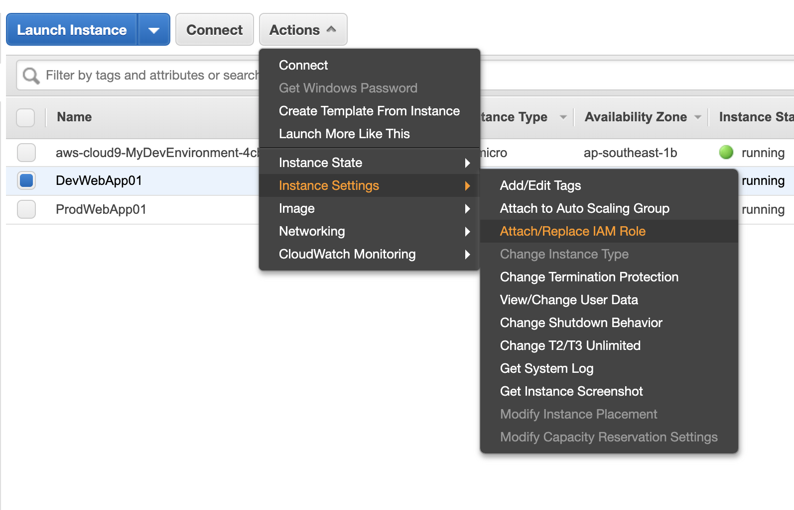
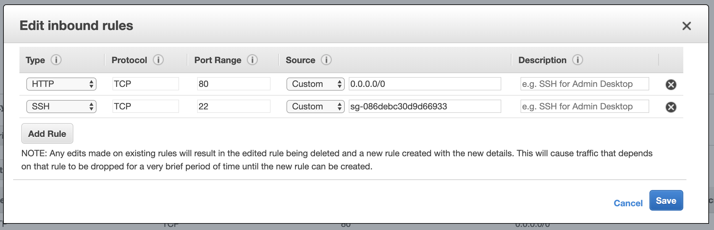
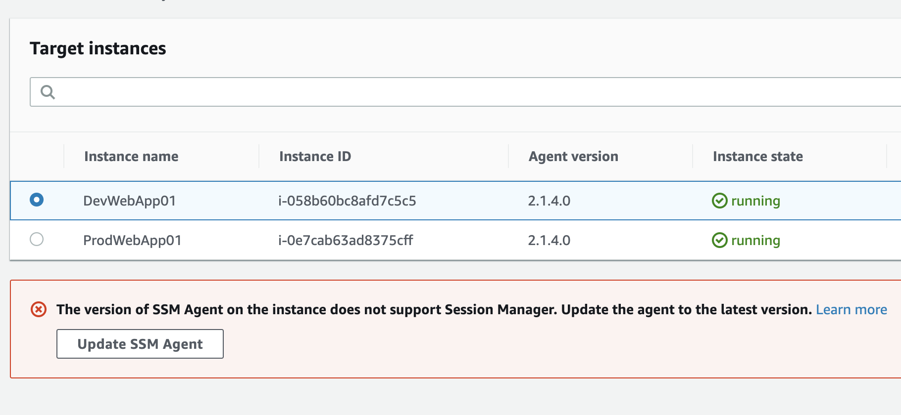
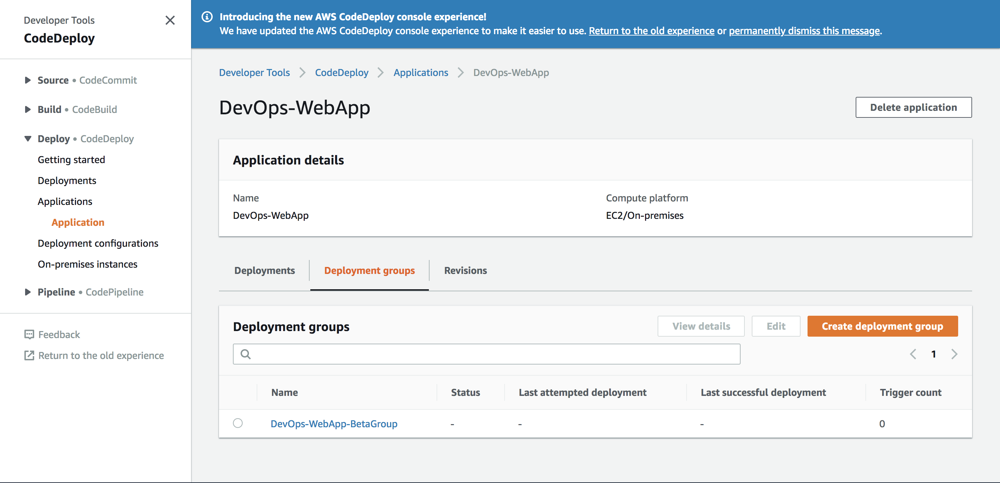
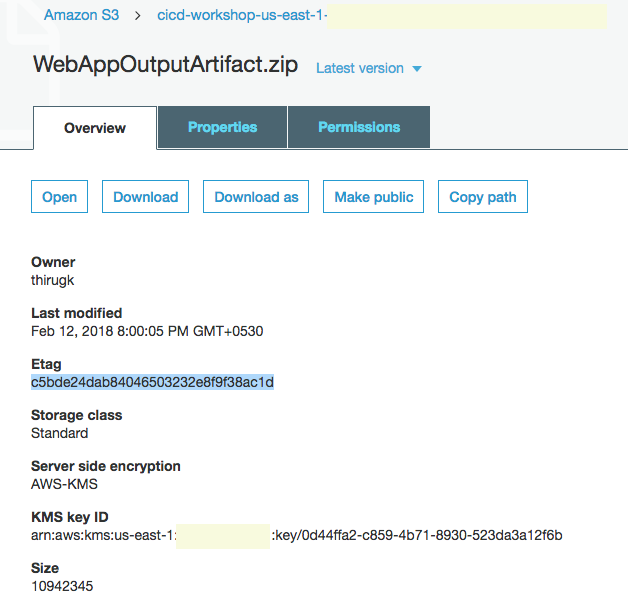
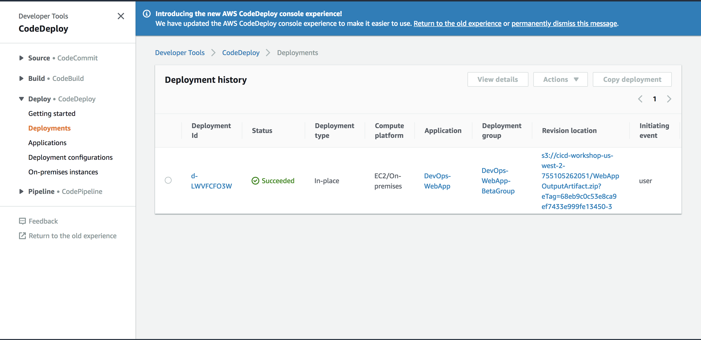
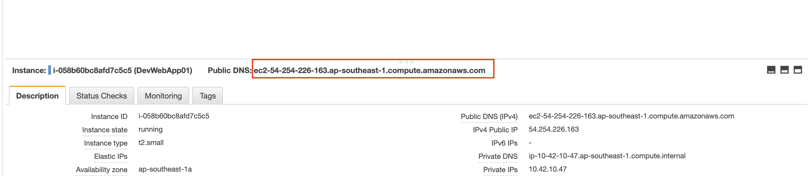
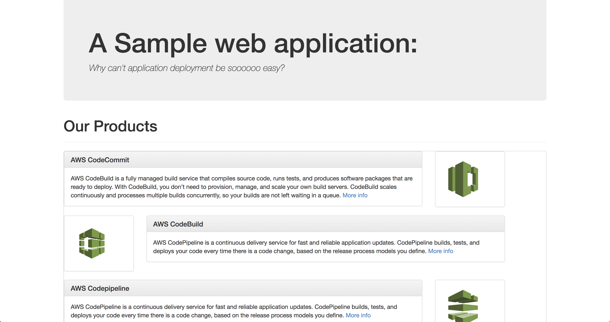

## Lab 2 - Automate deployment for testing

### Stage 1: Prepare environment for Testing (as well as for Production - Lab 3)

1. Run the CloudFormation stack using the following AWS CLI command:

```console
user:~/environment/WebAppRepo (master) $ aws cloudformation create-stack --stack-name DevopsWorkshop-Env \
--template-body https://yhlim-share.s3-ap-southeast-1.amazonaws.com/labs/devops/02-aws-devops-workshop-environment-setup.template 
```
2. After the CloudFromation Stack has completed, go to view your [EC2 console](https://ap-southeast-1.console.aws.amazon.com/ec2/v2/home?region=ap-southeast-1#Instances:sort=desc:launchTime) to view the EC2 instances.

**_Note_**
  - The Stack will have a VPC w/ 1 public subnet, an IGW, route tables, ACL, 2 EC2 instances. Also, the EC2 instances will be launched with a User Data script to **automatically install the AWS CodeDeploy agent**.

  - You can refer to [this instruction](http://docs.aws.amazon.com/codedeploy/latest/userguide/codedeploy-agent-operations-install.html) to install the CodeDeploy agent for other OSs like Amazon Linux, RHEL, Ubuntu, or Windows.
 
#### Note: The additional steps below are required due to the IAM constraints of the Lab AWS Accounts. ####

3. Attach IAM Role (Team Role) to the the Dev EC2 instance (DevWebApp01) created by selecting the instance and click on the ***Action Button -> Instance -> Instance Settings -> Attach/Detach IAM Role***.



4. Next find in the drop-down box the ***Team Role*** under IAM Role and click Apply.

5. Repeat steps 2-4 for Production EC2 Instance (ProdWebApp01).

6. Go to the [Security Group](https://ap-southeast-1.console.aws.amazon.com/ec2/v2/home?region=ap-southeast-1#SecurityGroups:Name=WebAppSG;sort=vpcId) section in the console.

7. Look for ***WebAppSg*** Security Group and copy/remember the ***Group ID***.

8. Select ***WebAppSG*** Security Group and click on the Inbound tab and click Edit.

9. Add a new Rule, Type = SSH, Source = Custom, paste the ***Group ID*** copied earlier. Click Save.


10. Go to [Systems Manager console](https://ap-southeast-1.console.aws.amazon.com/systems-manager/session-manager/sessions?region=ap-southeast-1) under Session Manager.

11. Click ***Start Session***, select DevWebApp01 and click Update SSM Agent. Confirm Update SSM Agent. Go back to Systems Manager.


12. You might have to repeat step 10-11 twice in order for the agent to be updated successfully.

13. Go back to [Systems Manager console](https://ap-southeast-1.console.aws.amazon.com/systems-manager/session-manager/sessions?region=ap-southeast-1) and click ***Start Session***, select DevWebApp01 and click Start Session.

14. Run the following command to restart the CodeDeploy Agent. ***It will take some time to restart, terminate the session after it ends***

```console
$ sudo service codedeploy-agent restart
```

15. Repeat steps 10-14 for Production EC2 Instance (ProdWebApp01). 


***

### Stage 2: Create CodeDeploy Application and Deployment group

1. Run the following to create an application for CodeDeploy.

```console
user:~/environment/WebAppRepo (master) $ aws deploy create-application --application-name DevOps-WebApp
```

2. Run the following to create a deployment group and associates it with the specified application and the user's AWS account. You need to replace the service role with **Team Role**.

```console
user:~/environment/WebAppRepo (master) $ aws deploy create-deployment-group --application-name DevOps-WebApp \
--deployment-config-name CodeDeployDefault.OneAtATime \
--deployment-group-name DevOps-WebApp-BetaGroup \
--ec2-tag-filters Key=Name,Value=DevWebApp01,Type=KEY_AND_VALUE \
--service-role-arn <<REPLACE-WITH-TEAM-ROLE-ARN>>
```

**_Note:_** We are using the tags to attach instances to the deployment group.

3. Let us review all the changes by visiting the [CodeDeploy Console](https://console.aws.amazon.com/codedeploy/home).



***

### Stage 3: Prepare application for deployment

1. Without an AppSpec file, AWS CodeDeploy cannot map the source files in your application revision to their destinations or run scripts at various stages of the deployment.

2. Copy the template into a text editor and **save** the file as **_appspec.yml_** in the **_WebAppRepo_** directory of the revision.

```yml
version: 0.0
os: linux
files:
  - source: /target/javawebdemo.war
    destination: /tmp/codedeploy-deployment-staging-area/
  - source: /scripts/configure_http_port.xsl
    destination: /tmp/codedeploy-deployment-staging-area/
hooks:
  ApplicationStop:
    - location: scripts/stop_application
      timeout: 300
  BeforeInstall:
    - location: scripts/install_dependencies
      timeout: 300
  ApplicationStart:
    - location: scripts/write_codedeploy_config.sh
    - location: scripts/start_application
      timeout: 300
  ValidateService:
    - location: scripts/basic_health_check.sh

```

As a sample shown below:


3. **_Review_** the **_script folder_** in the repo for the various scripts like Start, Stop, health check etc. These scripts will be called as per the hook definition in **_appspec.yml_** file during deployment.

4. Since we are going to deploy the application via CodeDeploy, we need to package additional files needed by CodeDeploy. Let us **_make change_** to the **_buildspec.yml_** to incorporate the changes.

```yml
version: 0.1

phases:
  install:
    commands:
      - echo Nothing to do in the install phase...
  pre_build:
    commands:
      - echo Nothing to do in the pre_build phase...
  build:
    commands:
      - echo Build started on `date`
      - mvn install
  post_build:
    commands:
      - echo Build completed on `date`
artifacts:
  files:
    - appspec.yml
    - scripts/**/*
    - target/javawebdemo.war

```

5. **Save** the changes to buildspec.yml. 

6. Commit & push the build specification file to repository

```console
user:~/environment/WebAppRepo/ $ git add buildspec.yml
user:~/environment/WebAppRepo/ $ git add appspec.yml
user:~/environment/WebAppRepo/ $ git commit -m "changes to build and app spec"
user:~/environment/WebAppRepo/ $ git push -u origin master

```

***

### Stage 4: Deploy an application revision

1. Run the **_start-build_** command:

```console
user:~/environment/WebAppRepo (master) $ aws codebuild start-build --project-name devops-webapp-project
```

2. Visit the [CodeBuild Console](https://ap-southeast-1.console.aws.amazon.com/codesuite/codebuild/projects/devops-webapp-project/history) build history to ensure build is successful. Upon successful completion of build, we should see new **_WebAppOutputArtifact.zip_** uploaded to the configured CodeBuild S3 Bucket.

3. Get the **_eTag_** for the object **WebAppOutputArtifact.zip** uploaded to S3 bucket. You can get etag by visiting S3 console. Or, executing the following command.

```console
user:~/environment/WebAppRepo (master) $ aws s3api head-object --bucket <<YOUR-CODEBUILD-OUTPUT-BUCKET>> \
--key WebAppOutputArtifact.zip

```

As a sample S3 properties console showing etag below:



4. Run the following to create a deployment. **_Replace_** <<YOUR-CODEBUILD-OUTPUT-BUCKET>> with your **_S3 bucket name_** created in Lab 1. Also, update the **_eTag_** based on previous step.

```console
user:~/environment/WebAppRepo (master) $ aws deploy create-deployment --application-name DevOps-WebApp \
--deployment-group-name DevOps-WebApp-BetaGroup \
--description "My very first deployment" \
--s3-location bucket=<<YOUR-CODEBUILD-OUTPUT-BUCKET>>,key=WebAppOutputArtifact.zip,bundleType=zip,eTag=<<YOUR-ETAG-VALUE>>
```

5. **Verify** the deployment status by visiting the [CodeDeploy console](https://ap-southeast-1.console.aws.amazon.com/codesuite/codedeploy/deployments?region=ap-southeast-1).



6. Check the deploy console for status. if the deployment failed, then look at the error message and correct the deployment issue.

7. If the status of deployment is success, we should be able to view the web application deployed successfully to the EC2 server namely **_DevWebApp01_**

8. Go to the [EC2 Console](https://ap-southeast-1.console.aws.amazon.com/ec2/v2/home?region=ap-southeast-1), get the **public DNS name** of the DevWebApp01 instance.



9. Open the public DNS name in a browser to see the sample web application deployed.



### Summary

This **concludes Lab 2**. In this lab, we successfully created CodeDeploy application and deployment group. We also modified buildspec.yml to include additional components needed for deployment. We also successfully completed deployment of application to test server. You can now move to the next Lab,

[Lab 3 - Setup CI/CD using AWS CodePipeline](3_Lab3.md)
