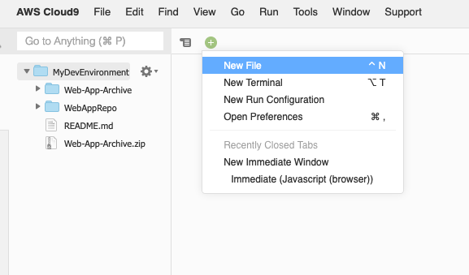

## [CLI] Lab 2 - Automate deployment for testing

### Stage 1: Prepare environment for Dev and Prod Servers

We will be using **AWS CloudFormation** to quickly deploy our Dev and Prod environments, complete with the VPC, subnets, security groups and instance profile all setup.

1. Run the following command to deploy the CloudFormation script:
```console
user:~/environment $ aws cloudformation create-stack --stack-name MyWebStack --template-url https://aws-labs-workshops.s3-ap-southeast-1.amazonaws.com/aws-devops-workshop-environment-setup.template --capabilities CAPABILITY_IAM
```
2. You can check the progress of the stack creation progress by running the command:
  ```console
  user:~/environment $ aws cloudformation list-stacks
  ```

3. After the CloudFormation Stack has completed, you can go to the [EC2 console](https://ap-southeast-1.console.aws.amazon.com/ec2/v2/home?region=ap-southeast-1#Instances:sort=desc:launchTime) to view the EC2 instances.


>**_Note:_** The Stack will have a VPC with 1 public subnet, an Internet Gateway, route tables, ACL, 2 EC2 instances (1 Dev and 1 Prod). Also, the EC2 instances will be launched with a User Data script that will **automatically install the AWS CodeDeploy agent** upon initialization.
>
>You can refer to [this instruction](http://docs.aws.amazon.com/codedeploy/latest/userguide/codedeploy-agent-operations-install.html) to install the CodeDeploy agent for other OSs like Amazon Linux, RHEL, Ubuntu, or Windows.

***

### Stage 2: Create the Deploy Service Role

1. Before we begin, let's create an IAM role for this Deploy service to give it permissions to call other AWS services on your behalf. Open up a **New File** in your Cloud9 console.

  

3. Paste the following content:
  ```json
  {
    "Version": "2012-10-17",
    "Statement": [
      {
        "Effect": "Allow",
        "Principal": {
          "Service": "codedeploy.amazonaws.com"
        },
        "Action": "sts:AssumeRole"
      }
    ]
  }
  ```
  **_💡 Tip_** As you can see in the policy document above, we're going to create a role that allows CodeDeploy to assume it.


4. Save the file by clicking on File > Save. Enter `codedeploy-policy.json` as the **Filename** and save the file in the  **MyDevEnvironment** root folder as shown.


5. Run the following command in your Cloud9 IDE to create a role:
  ```console
  user:~/environment (master) $ aws iam create-role --role-name CodeDeployRole --assume-role-policy-document file://../codedeploy-policy.json
  ```
6. If successful, you will see the output of the **CodeDeployRole** that we have just created. Note down the **Arn** value and save it somewhere. We will need it later.

  

6. We will attach several managed policies to this role to grant it permissions. Run the commands below:
  ```console
  user:~/environment (master) $ aws iam attach-role-policy --policy-arn arn:aws:iam::aws:policy/AWSCodeDeployRole --role-name CodeDeployRole
  ```
  **_Note:_** The managed policies attached above are for this lab environment only. In a Production environment, you will **not** be giving such a wide policy permission.

7. That's it! You can verify that the policies have successfully been attached to the role by running the command:
  ```console
  user:~/environment (master) $ aws iam list-attached-role-policies --role-name CodeDeployRole
  ```
8. You will see the list as shown:
  ```console
  {
      "AttachedPolicies": [
          {
              "PolicyName": "AWSCodeDeployRole",
              "PolicyArn": "arn:aws:iam::aws:policy/service-role/AWSCodeDeployRole"
          }
      ]
  }
  ```

### Stage 3: Create CodeDeploy Application and Deployment group

**AWS CodeDeploy** is a fully managed deployment service that automates software deployments to a variety of compute services such as Amazon EC2, Fargate, Lambda and even on-premise servers. You can use AWS CodeDeploy to automate software deployments, eliminating the need for error-prone manual operations. The service scales to match your deployment needs.


1. Run the following to create an application for CodeDeploy.

  ```console
  user:~/environment/WebAppRepo (master) $ aws deploy create-application --application-name MyWebApp
  ```

2. Run the following to create a deployment group and associate it with the specified application and the user's AWS account. You need to replace the service role with the **CodeDeployRole ARN** from the previous steps.

  ```console
  user:~/environment/WebAppRepo (master) $ aws deploy create-deployment-group --application-name MyWebApp \
  --deployment-config-name CodeDeployDefault.OneAtATime \
  --deployment-group-name WebApp-Dev \
  --ec2-tag-filters Key=Name,Value=DevWebApp01,Type=KEY_AND_VALUE \
  --service-role-arn <<REPLACE-WITH-CODEDEPLOY-ROLE-ARN>>
  ```

  **_Note:_** We are using the tags to attach instances to the deployment group.

3. You can review all the changes by visiting the [CodeDeploy Console](https://console.aws.amazon.com/codedeploy/home).

***

### Stage 4: Prepare application for deployment

An AppSpec file is a YAML file used by CodeDeploy to determine:
- What it should install onto your instances from your application revision in Amazon S3 or GitHub.
- Which lifecycle event hooks to run in response to deployment lifecycle events.

Let's now create an AppSpec file so that AWS CodeDeploy can map the source files in your application revision to their destinations and run scripts at various stages of the deployment.

1. Copy the template into a text editor in your Cloud9 Console as a new file and **save** the file as `appspec.yml` in the **_WebAppRepo_** directory of the revision.

  ```yml
  version: 0.0
  os: linux
  files:
    - source: /target/javawebdemo.war
      destination: /tmp/codedeploy-deployment-staging-area/
    - source: /scripts/configure_http_port.xsl
      destination: /tmp/codedeploy-deployment-staging-area/
  hooks:
    ApplicationStop:
      - location: scripts/stop_application
        timeout: 300
    BeforeInstall:
      - location: scripts/install_dependencies
        timeout: 300
    ApplicationStart:
      - location: scripts/write_codedeploy_config.sh
      - location: scripts/start_application
        timeout: 300
    ValidateService:
      - location: scripts/basic_health_check.sh
  ```
  As a sample shown below:

  

> Do spend some time to have a look at the scripts (.sh files) in _scripts_ folder in the WebAppRepo for the various scripts like Start, Stop, health check etc. These scripts will be called as per the hook definition in the _appspec.yml_ file during deployment.

2. Since we are going to deploy the application via CodeDeploy, we need to package additional files needed by CodeDeploy. Let us **_make changes_** to the **_buildspec.yml_** to incorporate the changes.

  ```yml
  version: 0.2

  phases:
    install:
      runtime-versions:
          java: openjdk8
    pre_build:
      commands:
        - echo Nothing to do in the pre_build phase...
    build:
      commands:
        - echo Build started on `date`
        - mvn install
    post_build:
      commands:
        - echo Build completed on `date`
  artifacts:
    files:
      - appspec.yml
      - scripts/**/*
      - target/javawebdemo.war
  ```

3. **Save** the changes to buildspec.yml.

4. Commit & push the build specification file to repository by running the following commands:

  ```console
  user:~/environment/WebAppRepo/ $ git add *.yml
  user:~/environment/WebAppRepo/ $ git commit -m "changes to build and app spec"
  user:~/environment/WebAppRepo/ $ git push -u origin master
  ```
***

### Stage 5: Build and Deploy an application revision

1. Run the **_start-build_** command:
  ```console
  user:~/environment/WebAppRepo (master) $ aws codebuild start-build --project-name MyCodeBuildProject
  ```

2. Visit the [CodeBuild Console](https://ap-southeast-1.console.aws.amazon.com/codesuite/codebuild/projects/devops-webapp-project/history) build history to ensure build is successful. Upon successful completion of build, we should see new **_WebAppOutputArtifact.zip_** uploaded to the configured CodeBuild S3 Bucket.

3. Get the **_eTag_** for the object **WebAppOutputArtifact.zip** uploaded to S3 bucket. You can get etag by visiting S3 console. Or, executing the following command.

  ```console
  user:~/environment/WebAppRepo (master) $ aws s3api head-object --bucket <<YOUR-S3-BUCKET-NAME>> \
  --key WebAppOutputArtifact.zip
  ```

  >**_Note:_** The artifact eTag changes each time you execute a Build.

  As a sample S3 properties console showing etag below:
  

4. Run the following to create a deployment. **_Replace_** <<YOUR-S3-BUCKET-NAME>> with your **_S3 bucket name_** created in Lab 1. Also, update the **_eTag_** based on previous step.

```console
user:~/environment/WebAppRepo (master) $ aws deploy create-deployment --application-name MyWebApp \
--deployment-group-name WebApp-Dev \
--description "My very first deployment" \
--s3-location bucket=<<YOUR-S3-BUCKET-NAME>>,key=WebAppOutputArtifact.zip,bundleType=zip,eTag=<<YOUR-ETAG-VALUE>>
```

5. **Verify** the deployment status by visiting the [CodeDeploy console](https://ap-southeast-1.console.aws.amazon.com/codesuite/codedeploy/deployments?region=ap-southeast-1).

  

6. Check the deploy console for status. if the deployment failed, then look at the error message and correct the deployment issue.

7. If the status of deployment is success, we should be able to view the web application deployed successfully to the EC2 server namely **_DevWebApp01_**

8. Go to the [EC2 Console](https://ap-southeast-1.console.aws.amazon.com/ec2/v2/home?region=ap-southeast-1), get the **public DNS name** of the DevWebApp01 instance.

  

9. Open the public DNS name in a browser to see the sample web application deployed.

  

### Summary

This **concludes Lab 2**. In this lab, we successfully created CodeDeploy application and deployment group. We also modified buildspec.yml to include additional components needed for deployment. We also successfully completed deployment of application to our development server. You can now move to the next Lab:

[Lab 3 - Setup CI/CD using AWS CodePipeline](https://github.com/yiangmeng/aws-devops-introduction/blob/cli/3_Lab3.md)
