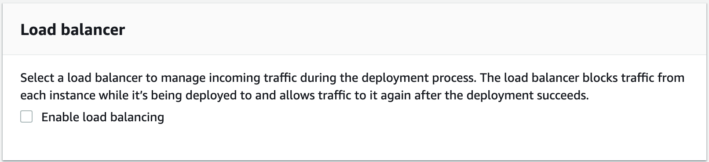

## [Console] Lab 2 - Automate deployment for testing

### Stage 1: Prepare environment for Dev and Prod Servers

We will be using **AWS CloudFormation** to quickly deploy our Dev and Prod environments, complete with the VPC, subnets, security groups and instance profile all setup.

1. Head over to the [AWS CloudFormation](https://ap-southeast-1.console.aws.amazon.com/cloudformation/home?region=ap-southeast-1) console.

2. Click on **Create stack**.

3. Select **_Template is ready_** for **Prepare template**.

4. Select **_Amazon S3 URL_** for **Template source**.

5. Paste `https://aws-labs-workshops.s3-ap-southeast-1.amazonaws.com/aws-devops-workshop-environment-setup.template` in **Amazon S3 URL**.

6. Click on **Next**.

7. Enter `MyWebStack` as **Stack name** and click on **Next**.

8. Accept the default stack options and click on **Next**.

9. Check **_I acknowledge that AWS CloudFormation might create IAM resources._** and click on **Create stack** to begin creating the stack. The stack creation process can take a couple of minutes. You may proceed to the next stage while the stack is building.

10. After the CloudFormation Stack has completed, you can go to the [EC2 console](https://ap-southeast-1.console.aws.amazon.com/ec2/v2/home?region=ap-southeast-1#Instances:sort=desc:launchTime) to view the EC2 instances.

>**_Note:_** The Stack will have a VPC with 1 public subnet, an Internet Gateway, route tables, ACL, 2 EC2 instances (1 Dev and 1 Prod). Also, the EC2 instances will be launched with a User Data script that will **automatically install the AWS CodeDeploy agent** upon initialization.
>
>You can refer to [this instruction](http://docs.aws.amazon.com/codedeploy/latest/userguide/codedeploy-agent-operations-install.html) to install the CodeDeploy agent for other OSs like Amazon Linux, RHEL, Ubuntu, or Windows.

***

### Stage 2: Create the Deploy Service Role

1. Let's now initialize a AWS CodeDeploy application deployment. Before we do that, let's create an IAM role for this Deploy service to give it permissions to call other AWS services on your behalf. Head over to [IAM Roles](https://console.aws.amazon.com/iam/home?#/roles) console.

2. Click on **Create role**.

3. Under **Select type of trusted entity**, choose **AWS service**.

4. Under **Choose the service that will use this role** select **CodeDeploy**.

5. Select **_CodeDeploy_** for **Use case**

  

6. Click on **Next: Permissions**.

7. There should already be a policy **AWSCodeDeployRole** attached. Click on **Next: Tags** to proceed.

8. Click on **Next: Review**.

9. Enter `CodeDeployRole` in **Role name**.

10. Click on **Create role** to complete creating the role.


### Stage 2: Create CodeDeploy Application and Deployment group

**AWS CodeDeploy** is a fully managed deployment service that automates software deployments to a variety of compute services such as Amazon EC2, Fargate, Lambda and even on-premise servers. You can use AWS CodeDeploy to automate software deployments, eliminating the need for error-prone manual operations. The service scales to match your deployment needs.

1. Head over to the [AWS CodeDeploy Applications](https://ap-southeast-1.console.aws.amazon.com/codesuite/codedeploy/applications?region=ap-southeast-1) console.

2. Click on **Create Application**.

3. Enter `MyWebApp` for **Application name**.

4. Select **_EC2/On-premises_** for **Compute platform**.

  

5. Click on **Create Application**.

> Each Application can have multiple Deployment Groups. In an EC2/On-Premises deployment, a deployment group is a set of individual instances targeted for a deployment. A deployment group contains individually tagged instances, Amazon EC2 instances in Amazon EC2 Auto Scaling groups, or both.

6. Let's create a deployment group for our application to target the instances we have just created. Click on **Create deployment group**.

7. Enter `WebApp-Dev` for the **Deployment group name**.

8. Select **_CodeDeployRole_** for the **Service role**.

9. Select **_In-place_** for **Deployment Type**.

10. Check **_Amazon EC2 instances_** for **Environment configuration**.

11. Under **Tag group 1**, enter `Name` for **Key** and `DevWebApp01` for **Value**.

  

12. You should see *1 unique matched instance* under **Matching instances**.
> **Note:** The CloudFormation template launched earlier created an EC2 instance for Dev which has a tag value of DevWebApp01.

13. Select **_CodeDeployDefault.OneAtATime_** for **Deployment configuration**.

  

14. Uncheck **Enable load balancing**.

  

15. Click on **Create deployment group** to complete the creation.

***

### Stage 3: Prepare application for deployment

An AppSpec file is a YAML file used by CodeDeploy to determine:
- What it should install onto your instances from your application revision in Amazon S3 or GitHub.
- Which lifecycle event hooks to run in response to deployment lifecycle events.

Let's now create an AppSpec file so that AWS CodeDeploy can map the source files in your application revision to their destinations and run scripts at various stages of the deployment.

1. Copy the template into a text editor in your Cloud9 Console as a new file and **save** the file as `appspec.yml` in the **_WebAppRepo_** directory of the revision.

  ```yml
  version: 0.0
  os: linux
  files:
    - source: /target/javawebdemo.war
      destination: /tmp/codedeploy-deployment-staging-area/
    - source: /scripts/configure_http_port.xsl
      destination: /tmp/codedeploy-deployment-staging-area/
  hooks:
    ApplicationStop:
      - location: scripts/stop_application
        timeout: 300
    BeforeInstall:
      - location: scripts/install_dependencies
        timeout: 300
    ApplicationStart:
      - location: scripts/write_codedeploy_config.sh
      - location: scripts/start_application
        timeout: 300
    ValidateService:
      - location: scripts/basic_health_check.sh
  ```
  As a sample shown below:

  

> Do spend some time to have a look at the scripts (.sh files) in _scripts_ folder in the WebAppRepo for the various scripts like Start, Stop, health check etc. These scripts will be called as per the hook definition in the _appspec.yml_ file during deployment.

2. Since we are going to deploy the application via CodeDeploy, we need to package additional files needed by CodeDeploy. Let us **_make changes_** to the **_buildspec.yml_** to incorporate the changes.

  ```yml
  version: 0.2

  phases:
    install:
      runtime-versions:
          java: openjdk8
    pre_build:
      commands:
        - echo Nothing to do in the pre_build phase...
    build:
      commands:
        - echo Build started on `date`
        - mvn install
    post_build:
      commands:
        - echo Build completed on `date`
  artifacts:
    files:
      - appspec.yml
      - scripts/**/*
      - target/javawebdemo.war
  ```

3. **Save** the changes to buildspec.yml.

4. Commit & push the build specification file to repository by running the following commands:

```console
user:~/environment/WebAppRepo/ $ git add *.yml
user:~/environment/WebAppRepo/ $ git commit -m "changes to build and app spec"
user:~/environment/WebAppRepo/ $ git push -u origin master

```

***

### Stage 4: Build and Deploy an application revision

1. Head over to the [AWS CodeBuild](https://ap-southeast-1.console.aws.amazon.com/codesuite/codebuild/projects?region=ap-southeast-1) console.

2. Select the build project **MyCodeBuildProject** and click **Start build**.

3. Accept the defaults and click **Start build** to begin the build process.

>Alternatively, you can also initiate a start-build command from your Cloud9 console via the following command:
```console
user:~/environment/WebAppRepo (master) $ aws codebuild start-build --project-name MyCodeBuildProject
```

4. Once the build has completed, head over to the [AWS CodeDeploy Applications](https://ap-southeast-1.console.aws.amazon.com/codesuite/codedeploy/applications?region=ap-southeast-1) console.

5. Open up the Application **MyWebApp**.

6. Open up the deployment group **WebApp-Dev**.

7. Click on **Create deployment**.

  

8. Select **_WebApp-Dev_** for the **Deployment group**.

9. Select **_My application is stored in Amazon S3_** for the **Revision type**.

10. Enter `s3://webapp-bucket-12345/WebAppOutputArtifact.zip` where `12345` corresponds to the S3 bucket name you have specified for the **Revision location**.

11. Select **_.zip_** for **Revision file type**.

  

12. Click on **Create deployment** to start deploying the build.

13. Verify that deployment succeeds.

  

14. Go to the [EC2 Console](https://ap-southeast-1.console.aws.amazon.com/ec2/v2/home?region=ap-southeast-1), get the **public DNS name** of the DevWebApp01 instance.

  

9. Open the public DNS name in a browser to see the sample web application deployed.

  

### Summary

This **concludes Lab 2**. In this lab, we successfully created CodeDeploy application and deployment group. We also modified buildspec.yml to include additional components needed for deployment. We also successfully completed deployment of application to our development server. You can now move to the next Lab:

[Lab 3 - Setup CI/CD using AWS CodePipeline](https://github.com/yiangmeng/aws-devops-introduction/blob/master/3_Lab3.md)
