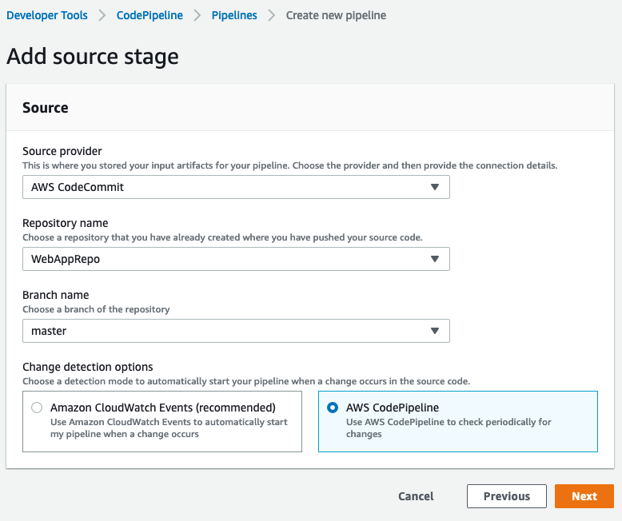
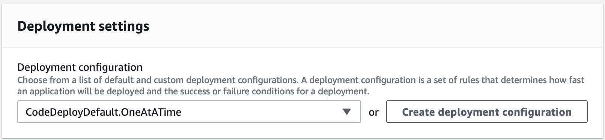

## Lab 3 - Setup CI/CD using AWS CodePipeline

### Stage 1: Create a Pipeline

**AWS CodePipeline** is a fully managed continuous delivery service that helps you automate your release pipelines for fast and reliable application and infrastructure updates. CodePipeline automates the build, test, and deploy phases of your release process every time there is a code change, based on the release model you define.

1. Head over to the [AWS CodePipeline](http://console.aws.amazon.com/codepipeline) console.

2. Click on **Create pipeline**.

3. Enter `MyWebAppPipeline` for the **Pipeline name**.

4. Select **_New service role_** for **Service role**.

5. Enter `AWSCodePipelineServiceRole-ap-southeast-1-MyWebAppPipeline` for the **Role name** (should already be pre-populated).

6. Open up the **Advanced settings** tab, for **Artifact store**, Select **Custom location** and choose the Bucket from drop down **_webapp-bucket-12345_** where **_12345_** is the bucket name you have defined, and then choose **Next**.

  

**_Note_**:
Within a single AWS account, each pipeline you create in a region must have a unique name. Names can be reused for pipelines in different regions. After you create a pipeline, you cannot change its name. For information about other limitations, see [Limits in AWS CodePipeline](https://docs.aws.amazon.com/codepipeline/latest/userguide/limits.html).

7. Select **_AWS CodeCommit_** for **Source provider**.

8. In **Repository name**, select **_WebAppRepo_**, which is the name of the AWS CodeCommit repository you created in Lab 1 to use as the source location for your pipeline.

9. In **Branch name**, from the drop-down list, choose the **_master_** branch.

10. In **Change Detection Mode** select **_AWS CodePipeline_**. Choose **Next step**.

  

11. On the **Step 3: Build** page, for **Build Provider**, choose **_AWS CodeBuild_**

12. For **Project name**, select **_MyCodeBuildProject_** which is the build project which we we created in Lab 1 and choose **Next**.

  

13. On the **Step 4: Deploy** page, for **Deploy provider**, select **AWS CodeDeploy**,

14. For **Application name**, select **MyWebApp**, which is the name of the application that was created in Lab 2.

15. For **Deployment group**, select **WebApp-Dev** which is the name of the deployment group that was created in Lab 2. Choose **Next**.

  

16. On the **Step 5: Review** page, review your pipeline configuration, and then choose **Create pipeline** to create the pipeline.

Image below shows successfully created pipeline.


10. Now that you've created your pipeline, you can view it in the console. Pipeline will start automatically in few minutes. Otherwise, test it by manually clicking the **Release** button.

Image below shows successfully executed pipeline.


**Congratulations!** You have successfully created an **automated** pipeline that pulls the code from source, build it and deploys to your **Dev** server! Next, let's look at how we can modify this to deploy to a **Production** server.
***

### Stage 2: Create CodeDeploy Deployment group for Production


1. Head over to the [AWS CodeDeploy Applications](https://ap-southeast-1.console.aws.amazon.com/codesuite/codedeploy/applications?region=ap-southeast-1) console.

2. Click **MyWebApp** to view the deployment groups.

3. You should see an existing **WebApp-Dev** Deployment Group created earlier for the Dev environment. Click **Create deployment group**.

4. Enter `WebApp-Prod` for the **Deployment group name**.

8. Select **_CodeDeployRole_** for the **Service role**.

9. Select **_In-place_** for **Deployment Type**.

10. Check **_Amazon EC2 instances_** for **Environment configuration**.

11. Under **Tag group 1**, enter `Name` for **Key** and `ProdWebApp01` for **Value**.

  

12. You should see *1 unique matched instance* under **Matching instances**.
> **Note:** The CloudFormation template launched earlier created an EC2 instance for Production as well, which has a tag value of ProdWebApp01.

13. Select **_CodeDeployDefault.OneAtATime_** for **Deployment configuration**.

  

14. Uncheck **Enable load balancing**.

  

15. Click on **Create deployment group** to complete the creation.

***

### Stage 3: Edit a Pipeline (Console)

You can use the [AWS CodePipeline console](https://ap-southeast-1.console.aws.amazon.com/codesuite/codepipeline/pipelines?region=ap-southeast-1) to add, edit, or remove stages in a pipeline, as well as to add, edit, or remove actions in a stage.

We will edit the pipeline to add the stage for production deployment and introduce manual gating for production deployment.

1. On the pipeline details page for **MyWebAppPipeline**, choose **Edit**. This opens the editing page for the pipeline.

  

2. To add a stage, click **+ Add stage** _after_ the existing **Deploy** Stage.

  

3. Provide a name for the stage as `Production`, and then add an one action to it. Items marked with an asterisk are required.

4. Then choose **+ Add action group**. In **Edit Action** section: provide name as `ProductionDeployment` and action provider as **AWS CodeDeploy**

5. In **Input artifacts**, select **_BuildArtifact_**

6. Choose the name of the application **_MyWebApp_** and the production deployment group **_WebApp-Prod_** as per created in the previous stage.

7. Choose **Done**.


8. Finally, save changes to the pipeline by clicking **Save** button on top.

***

### Stage 4: Add Manual approval action

In AWS CodePipeline, you can add an approval action to a stage in a pipeline at the point where you want the pipeline execution to stop so that someone with the required AWS Identity and Access Management (IAM) permissions can approve or reject the action.

If the action is approved, the pipeline execution resumes. If the action is rejected—or if no one approves or rejects the action within seven days of the pipeline reaching the action and stopping—the result is the same as an action failing, and the pipeline execution does not continue.

We will use **Simple Notification Service (SNS)** to provide the messaging mechanism for the approval emails.

1. Head over to the [Simple Notification Service (SNS)](https://ap-southeast-1.console.aws.amazon.com/sns/v3/home?region=ap-southeast-1#/homepage) console.

2. Start by creating a topic. Enter `WebApp-Approval-Topic` for the **Topic name**.

3. We can leave everything else as default and click **Create topic** to complete the creation.

4. On the dashboard page of the topic created, click on **Create subscription**.

5. The **Topic ARN** should already be pre-filled with the Topic which we created earlier.

6. Select **_Email_** as the **Protocol**.

7. Enter an email address in the **Endpoint** field that you would like to receive the approval notification when the approval step in CodePipeline is triggered.

  

8. Click on **Create subscription**.

9. A subscription approval email would be sent to the email you have specified. Check your email for that and **Acknowledge** the subscription to receive mails from topic.

  

10. Head back to the [CodePipeline console](https://ap-southeast-1.console.aws.amazon.com/codesuite/codepipeline/pipelines?region=ap-southeast-1).

11. On the **MyWebAppPipeline** details page, choose **Edit**. This opens the editing page for the pipeline. Choose **+ Add stage** at the point in the pipeline **between Deploy** and **Production** stage, and enter a name `Approval` for the **Stage name**.

  

12. Choose the **+ Add action group**.

13. In **Action name**, type `ProdApproval` to identify the action.

15. In **Action provider**, choose **_Manual approval_**.

16. In **SNS topic ARN**, choose the name of the topic created to send notifications for the approval action.

17. (Optional) In **Comments**, type any additional information you want to share with the reviewer.

  

18. Choose **Done**.

19. Click **Done** and save changes to pipeline by clicking **Save** button at the top of the page.

20. To test your action, choose **Release change** to process that commit through the pipeline.

***

### Stage 5: Approve or Reject an Approval Action in AWS CodePipeline

If you receive a notification that includes a direct link to an approval action, choose the **Approve or reject** link, sign in to the console if necessary, and then continue with step 7 below. Otherwise, use all the following steps.

1. Open the [AWS CodePipeline](https://console.aws.amazon.com/codepipeline/) console.

2. On the **All Pipelines** page, choose the name of the pipeline.

3. Locate the stage with the approval action.

4. Hover over the information icon to view the comments and URL, if any. The information pop-up message will also display the URL of content for you to review, if one was included.

5. If a URL was provided, choose the **Manual approval** link in the action to open the target Web page, and then review the content.

6. Return to the pipeline details view, and then choose the **Review** button.

7. In the **Approve or reject** the revision window, type comments related to your review, such as why you are approving or rejecting the action, and then choose the **Approve** or **Reject** button.


Once you approve, the pipeline continues and completes successfully.


***

### Stage 6: Commit Changes to Trigger Automatic Deployment

1. Go back to the Cloud9 environment.

2. Open up the **_index.jsp_** file from the path shown below:


3. Edit contents in `<p>` of the `<body>` HTML tree to add some text and **save** the file.


4. Change the directory to your local repo folder (if not already in WebAppRepo folder). Run **_git add_** to stage the change:

  ```console
  user:~/environment $ cd WebAppRepo
  user:~/environment/WebAppRepo/ $ git add *
  ```

5. Run **_git commit_** to commit the change:

  ```console
  user:~/environment/WebAppRepo/ $ git commit -m "Edited text"
  ```

6. Run **_git push_** to push your commit through the default remote name Git uses for your AWS CodeCommit repository (origin), from the default branch in your local repo (master):

  ```console
  user:~/environment/WebAppRepo/ $ git push -u origin master
  ```

7. View the pipeline flow in the [AWS CodePipeline](https://console.aws.amazon.com/codepipeline/) console. Note the change in commit ID and commit message.

>**Note:** Just like in the Dev server, you can find the Production server's **Public DNS address** in the EC2 Console to view the Production site.


### Summary

This **concludes Lab 3**. In this lab, we successfully created CodePipeline for continuous code build and deployment. We also modified CodePipeline to include manual approval action before deploying code to production environment. We also successfully completed continuous deployment of application to both Dev and Production servers.
