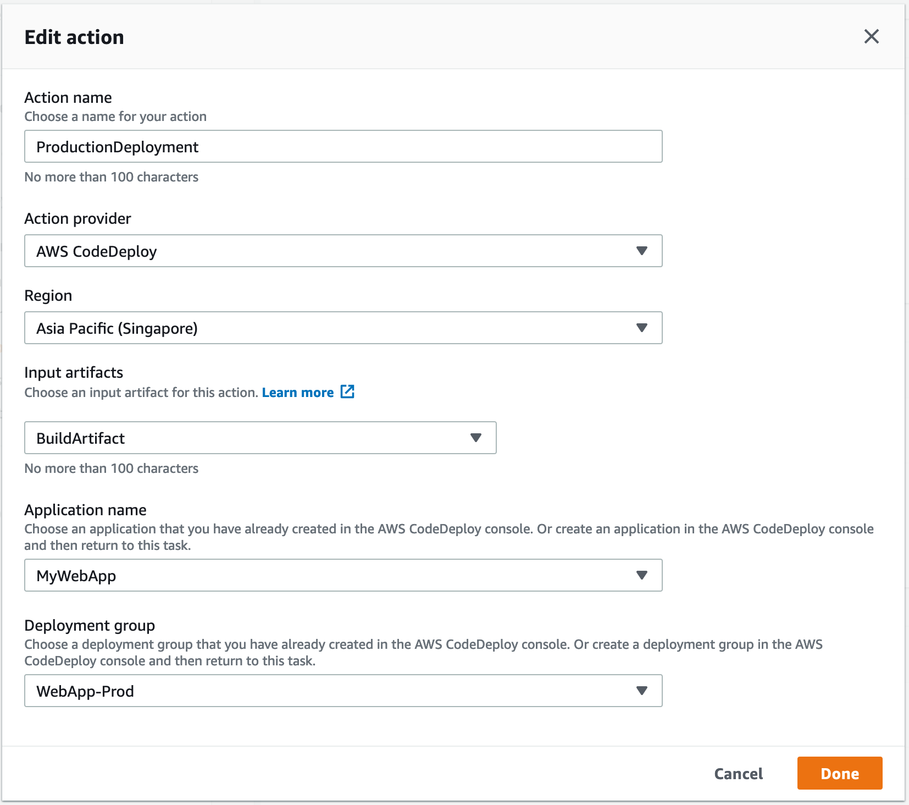

## Lab 3 - Setup CI/CD using AWS CodePipeline

### Stage 1: Create a Pipeline (Console)

To create a pipeline in the console, you'll need to provide the source file location and information about the providers you will use for your actions.

When you use the pipeline wizard, AWS CodePipeline creates the names of stages (Source, Build, Staging). These names cannot be changed. However, you can delete Build and Staging if you prefer to alter the names. You can give more specific names (for example, BuildToGamma or DeployToProd) to stages you add later.

Also, existing pipeline configuration can be exported and used to create pipeline in another region.

1. Sign in to the **AWS Management Console** and open the **AWS CodePipeline** console at [http://console.aws.amazon.com/codepipeline](http://console.aws.amazon.com/codepipeline).
2. On the **CodePipeline Home** page, choose **Create pipeline**.


3. On the **Step 1: Choose pipeline settings** page, in the **Pipeline name** box, type the name for your pipeline (your choice)

4. For **Service role**, Select **Existing service role** and choose the Role name from drop down **TeamRole**.

5. Open up the **Advanced settings** tab, for **Artifact store**, Select **Custom location** and choose the Bucket from drop down starting with **cicd-workshop**, and then choose **Next step**.

**_Note_**:
Within a single AWS account, each pipeline you create in a region must have a unique name. Names can be reused for pipelines in different regions. After you create a pipeline, you cannot change its name. For information about other limitations, see [Limits in AWS CodePipeline](https://docs.aws.amazon.com/codepipeline/latest/userguide/limits.html).

6. On the **Step 2: Source** page, in the **Source provider** drop-down list, select **AWS CodeCommit**.

7. In **Repository name**, choose **WebAppRepo**, which is the name of the AWS CodeCommit repository you created in Lab 1 to use as the source location for your pipeline. 

8. In **Branch name**, from the drop-down list, choose the **master** branch.

9. In **Change Detection Mode** select **AWS CodePipeline**. Choose **Next step**.

10. On the **Step 3: Build** page, for **Build Provider**, choose **AWS CodeBuild**, and in **Project name**, select **devops-webapp-project** which is the build project which we we created in Lab 1. Choose **Next**.

11. On the **Step 4: Deploy** page, for **Deploy provider**, select **AWS CodeDeploy**, and in **Application name**, select **DevOps-WebApp**, which is the name of the application that was created in Lab2. For **Deployment group**, select **DevOps-WebApp-BetaGroup** which is the name of the deployment group that was created in Lab2. Choose **Next**.

12. On the **Step 5: Review** page, review your pipeline configuration, and then choose **Create pipeline** to create the pipeline.

Image below shows successfully created pipeline.


10. Now that you've created your pipeline, you can view it in the console. Pipeline will start automatically in few minutes. Otherwise, test it by manually clicking the **Release** button.

Image below shows successfully executed pipeline.


***

### Stage 2: Create CodeDeploy Deployment group for Production

1. In your Cloud9 IDE, run the following to create a deployment group and associate it with the specified application and the user's AWS account. You need to replace the service role ARN with TeamRole ARN.

```console
user:~/environment $ aws deploy create-deployment-group --application-name DevOps-WebApp  \
--deployment-config-name CodeDeployDefault.OneAtATime \
--deployment-group-name DevOps-WebApp-ProdGroup \
--ec2-tag-filters Key=Name,Value=ProdWebApp01,Type=KEY_AND_VALUE \
--service-role-arn <<REPLACE-WITH-TEAM-ROLE-ARN>>
```

**_Note:_** We are using the different group name and Production tag to attach instance to the deployment group.

***

### Stage 3: Edit a Pipeline (Console)

You can use the [AWS CodePipeline console](https://ap-southeast-1.console.aws.amazon.com/codesuite/codepipeline/pipelines?region=ap-southeast-1) to add, edit, or remove stages in a pipeline, as well as to add, edit, or remove actions in a stage.

We will edit the pipeline to add the stage for production deployment and introduce manual gating for production deployment.

1. On the pipeline details page, choose **Edit**. This opens the editing page for the pipeline.

2. To add a stage, choose **+ Add stage** after the existing **Deploy** Stage.

3. Provide a name for the stage as **Production**, and then add an one action to it. Items marked with an asterisk are required.

4. Then choose **+ Add action group**. In **Edit Action** section: provide name as **ProductionDeployment** and action provider as **AWS CodeDeploy**

5. In **Input artifacts**, select **BuildArtifact**

6. Choose the name of the application **DevOps-WebApp** and the production deployment group **DevOps-WebApp-ProdGroup** as per created in the previous stage.

7. Choose **Done**.


8. Finally, save changes to the pipeline by clicking **Save** button on top.

***

### Stage 4: Add Manual approval action

In AWS CodePipeline, you can add an approval action to a stage in a pipeline at the point where you want the pipeline execution to stop so that someone with the required AWS Identity and Access Management (IAM) permissions can approve or reject the action.

If the action is approved, the pipeline execution resumes. If the action is rejected—or if no one approves or rejects the action within seven days of the pipeline reaching the action and stopping—the result is the same as an action failing, and the pipeline execution does not continue.

1. In your Cloud9 IDE, create an **SNS topic** for Approval notification. And note the **topic ARN** from the result.

```console
user:~/environment $ aws sns create-topic --name WebApp-Approval-Topic --region ap-southeast-1
```

2. **Subscribe** to the topic using your email id. **Replace** the **ARN** and **email id** placeholders accordingly.

```console
user:~/environment $ aws sns subscribe --topic-arn <<YOUR-TOPIC-ARN>> --protocol email --notification-endpoint <<YOUR-EMAIL-ID>>
```

3. A subscription approval email would be sent to the email you have specified. Check your email for that and **Acknowledge** the subscription to receive mails from topic.


4. On the pipeline details page, choose **Edit**. This opens the editing page for the pipeline. Choose **+ Add stage** at the point in the pipeline **between Deploy** and **Production** stage, and type a name **Approval** for the stage.

5. Choose the **+ Add action group**.

6. On the **Edit action** page, do the following:

7. In **Action name**, type a name to identify the action.

8. In **Action provider**, choose **Manual approval**.

9. In **SNS topic ARN**, choose the name of the topic created to send notifications for the approval action.

10. (Optional) In **Comments**, type any additional information you want to share with the reviewer.

11. Choose **Save**.

12. Save changes to pipeline by clicking **Save** button at the top of the page.

13. To test your action, choose **Release change** to process that commit through the pipeline, commit a change to the source specified in the source stage of the pipeline.

***

### Stage 5: Approve or Reject an Approval Action in AWS CodePipeline

If you receive a notification that includes a direct link to an approval action, choose the **Approve or reject** link, sign in to the console if necessary, and then continue with step 7 below. Otherwise, use all the following steps.

1. Open the **AWS CodePipeline console** at https://console.aws.amazon.com/codepipeline/.

2. On the **All Pipelines** page, choose the name of the pipeline.

3. _Locate_ the stage with the approval action.

4. Hover over the information icon to view the comments and URL, if any. The information pop-up message will also display the URL of content for you to review, if one was included.

5. If a URL was provided, choose the **Manual approval** link in the action to open the target Web page, and then review the content.

6. Return to the pipeline details view, and then choose the **Review** button.

7. In the **Approve or reject** the revision window, type comments related to your review, such as why you are approving or rejecting the action, and then choose the **Approve** or **Reject** button.


Once you approve, the pipeline continues and completes successfully.


***

### Stage 6: Commit Changes to Trigger Automatic Deployment

1. Go back to the Cloud9 environment.

2. Open up the web.xml file from the path shown below:


3. Edit <display-name> to add some (!) marks and save the file.
  


4. Change the directory to your local repo folder. Run **_git add_** to stage the change:

```console
user:~/environment $ cd WebAppRepo
user:~/environment/WebAppRepo/ $ git add *
```

5. Run **_git commit_** to commit the change:

```console
user:~/environment/WebAppRepo/ $ git commit -m "Let it fly!"
```

6. Run **_git push_** to push your commit through the default remote name Git uses for your AWS CodeCommit repository (origin), from the default branch in your local repo (master):

```console
user:~/environment/WebAppRepo/ $ git push -u origin master
```

***This will trigger the Code Pipeline to execute and deploy the changes (with approval) into the production environment*** 


### Summary

This **concludes Lab 3**. In this lab, we successfully created CodePipeline for continuous code build and deployment. We also modified CodePipeline to include manual approval action before deploying code to production environment. We also successfully completed continuous deployment of application to both test and production servers.
