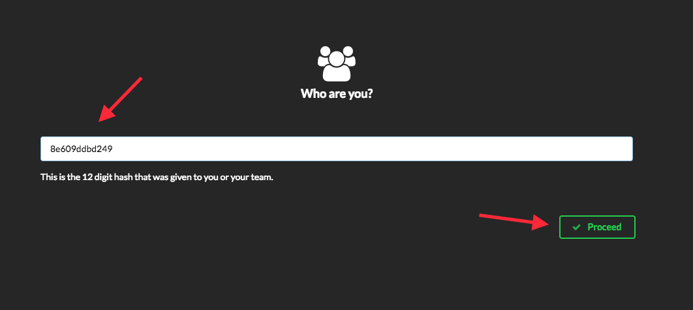

# AWS DevOps Introduction

## An Introductory Workshop on CI/CD Practices

In a few hours, quickly learn how to effectively leverage various AWS services to improve developer productivity and reduce the overall time to market for new product capabilities. In this session, we will demonstrate a prescriptive approach to incrementally adopt and embrace some of the best practices around continuous integration & delivery using AWS Developer Tools and 3rd party solutions including, **AWS CodeCommit** (a managed source control service), **AWS CodeBuild** (a fully managed build service), **AWS CodePipeline** (a fully managed continuous delivery service), and **AWS CodeDeploy** (an automated application deployment service). We will also highlight some best practices and productivity tips that can help make your software release process fast, automated, and reliable.

See the diagram below for a depiction of the complete architecture.

## Prerequisites - Getting a Lab Account

For this workshop, we will be issuing lab accounts for you to use to try out the services as documented. It is just like any other AWS account (with some IAM restrictions) and is completely **free to use**. You will not be charged for running any resources in these accounts. Do not store any sensitive information on these accounts. Note that the accounts will be terminated after the workshop, so do take measures to backup and save any work done.

> **Note:** As AWS accounts are a finite resource and we have obtained approval to provision them solely for this workshop's purpose, we'd like to ask you to be **frugal** on the usage.

1. Prior to the workshop, you will be sent a **12-character team hash**. If you do not have this, please sound out to the workshop facilitators for assistance.
2. Head over to the [Event Engine Dashboard](https://dashboard.eventengine.run/) to login with the hash.

  

3. Once you have logged in, you will be greeted with the **User Dashboard**. The AWS console can be access by clicking on the **AWS Console** button on the right.

  
  

> **Important:** Please use the region **Singapore (ap-southeast-1)** for all resources in this lab.

4. Let's get started! Head over to Lab 1 below to begin.

# Labs
This workshop is broken into multiple labs. You must complete each Lab before proceeding to the next.

:warning: **STOP!** We have prepared **two paths** you can take to complete this lab. Both paths lead to the same outcome, but with different experience. If you're a more visual person and is comfortable with clicking things and filling out forms to get things done, Choose **_Path 1_** below. If you're a pro-user of command line and loves to type stuff in a command prompt, **_Path 2_** is for you!

#### Path 1: Using AWS Console ####
1. [Lab 1 - Build project on the cloud](/tree/master/1_Lab1.md)
2. [Lab 2 - Automate deployment for testing](/tree/master/2_Lab2.md)
3. [Lab 3 - Setup CI/CD using AWS CodePipeline](/tree/master/3_Lab3.md)

#### Path 2: Command Line Interface (CLI) ####
1. [Lab 1 - Build project on the cloud](/tree/cli/1_Lab1.md)
2. [Lab 2 - Automate deployment for testing](/tree/cli/2_Lab2.md)
3. [Lab 3 - Setup CI/CD using AWS CodePipeline](/tree/cli/3_Lab3.md)

## License

This library is licensed under the Apache 2.0 License.
